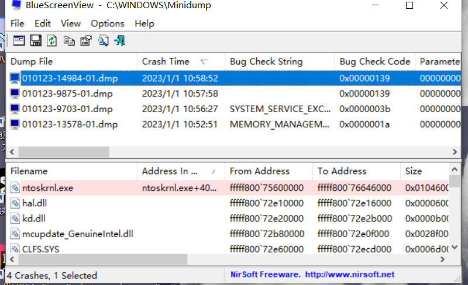
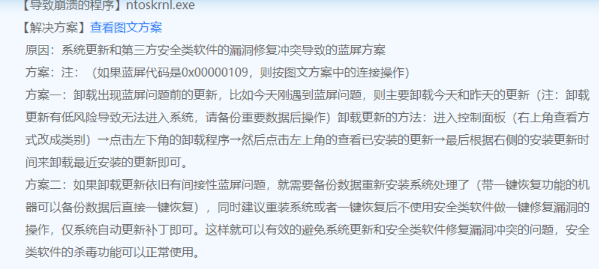
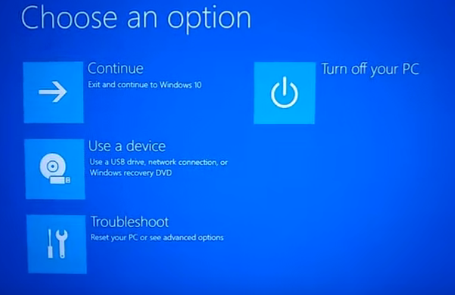

# 关于修复电脑蓝屏的问题

## **问题描述**

自从电脑12月20号系统自动更新后，开始出现蓝屏问题，在网上找了很久，还是找不到解决办法。倒是找到两个蓝屏分析工具。

- BlueScreenView:分析电脑存储蓝屏信息的dmp文件
  能分析出蓝屏错误代码，然后根据代码在网上寻找解决办法，但没什么卵用

* 蓝屏分析诊断工具V2.52.2264213

    这个是联想公司出的蓝屏分析工具，不知道其他品牌的电脑适不适用

    分析出来大概是因为系统更新冲突，要么尝试卸载更新要么只能重装系统。如果去重装系统很多编程环境就得重新搭建，这不又得再搞一个星期。

## 卸载更新

- 操作

设置->更新与安全->更新历史->卸载更新->卸载最近的更新

- 问题

卸载完成后，我发现下回重启电脑window会自动更新回来，然后又会再次出现蓝屏问题

## 阻止更新

- 尝试了一些网上给的方法阻止window自动更新，最后发现手动设置根本阻止不了他的流氓更新，只能借助工具

[
    Windows Update Blocker](https://www.sordum.org/9470/windows-update-blocker-v1-5/)

- 这个软件可以强制关闭window自动更新的服务，关闭之后我又重新对更新进行卸载，此时发现卸载更新错误
- 卸载更新失败是因为上回更新时没有更新完整，更新错误代码是0x80070003，应该是缺少更新需要的文件
- 作为数码强迫症的我这种事我真不能忍，我宁愿更新完整它蓝屏也不想它卡在那里，使电脑的状态处于不确定性
- 于是我开启了折腾之路

### 修复

关闭阻止更新的软件后，我参考了[(78条消息) #日常问题记--windows 10 更新错误，代码 0x80070003 的解决方法_投笔丶从戎的博客-CSDN博客_0x80070003](https://blog.csdn.net/qq_43519779/article/details/116743333)这个博客，把更新错误艰难地解决了

之后重启更新电脑几次后，悲剧般地发现电脑开机后一旦点进卸载更新，他就会报蓝屏错误

我不死心地操作了几次，成功让电脑开不了机，进入不了系统

好在在重启失败几次后，电脑进入修复页面

在我手动卸载了最近的更新后，电脑恢复正常

希望在接下来的日子他不要再出现蓝屏错误了，再出现我真的就只能重装系统了

#### 题外话

这里推荐一个修复系统的工具：[DirectX](https://blog.csdn.net/VBcom/article/details/7396482)

遇到系统错误的蓝屏问题可以尝试用这个工具修复一下，再考虑卸载更新或者重装系统
