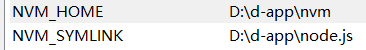
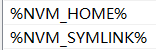
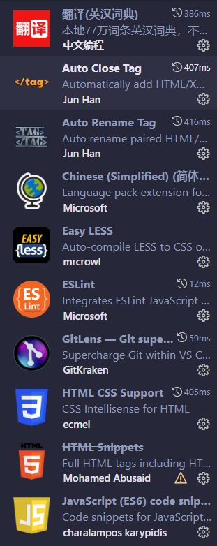
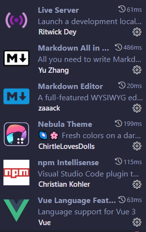

# 前端开发环境配置

## 利用nvm安装node.js

- [安装链接](https://github.com/coreybutler/nvm-windows/releases),下载最新版的nvm-setup.exe。根据提示下一步下一步即可。
- 打开命令行工具输入 `nvm version`后，出现版本即表示安装成功。
- 配置国内镜像网站 `nvm node_mirror https://npmmirror.com/mirrors/node/`
- 安装node

  ```
  nvm install latest//下载并安装最新版的node
  nvm install lts//安装稳定版的node
  nvm use latest//切换到最新版node
  nvm use lts//切换到稳定版node
  nvm use 版本号//切换到指定版本
  ```
- 命令行输入node检验是否安装成功
- [参考博客](https://www.lilichao.com/index.php/2022/10/08/node-js%e7%ae%80%e4%bb%8b%e5%ae%89%e8%a3%85/)
- 安装完成后电脑的环境变量会自动发生改变

  - 系统属性->高级->环境变量
  - 用户变量和系统变量多了
  - 用户变量和系统变量的path多了

## npm

- [npm网站](https://www.npmjs.com/)
- 修改npm的地址为镜像地址

  ```
  npm set registry https://registry.npmmirror.com
  ```

  ```
  npm config delete registry//恢复原版仓库配置
  ```
- [参考博客](https://www.lilichao.com/index.php/2022/10/21/%e5%8c%85%e7%ae%a1%e7%90%86%e5%99%a8/)

## Git

- 安装
- 安装完成后系统环境变量的path会多一个`git安装路径下的cmd目录`它使得git可以在命令行工具下使用，例如：`D:\d-app\Git\cmd`

## vscode

前端开发必备插件





## docusaurus

在运行docusaurus脚架项目，需配置用户变量和系统变量 Git_USER=用户名

## vue调式工具
在谷歌浏览器插件拓展开启开发者模式，导入下载好的调试工具

