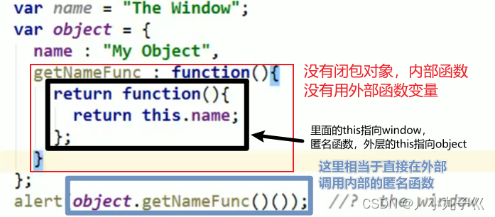
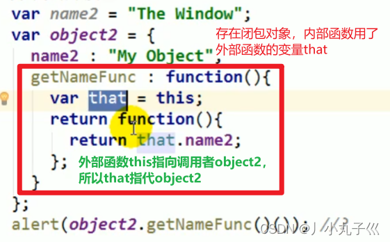
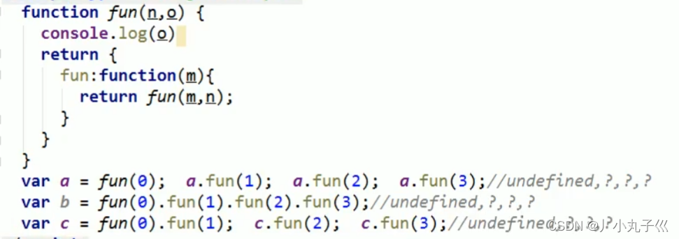
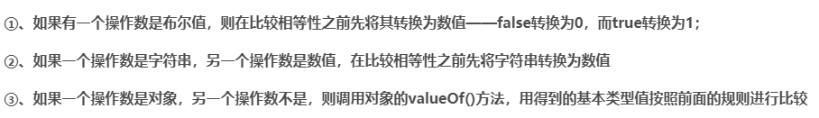
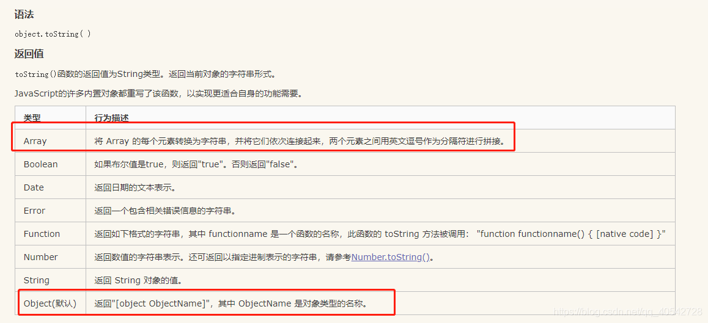

### 21.闭包面试题



答案是This Window 。this以函数形式调用时，this指向的是window。



答案是My Object。



答案是:

- undefined,0,0,0;
- undefined,0,1,2;
- undefined,0,1,1

### 22.数据类型存储以及堆栈内存是什么?堆(heap)和栈(stack)有什么区别存储机制?

- 基本数据类型：直接存储在栈内存中，占据空间小，大小固定，属于被频繁使用的数据。指的是保存在栈内存中的简单数据段；number string 布尔
- 引用数据类型：同时存储在栈内存与堆内存中，占据空间大，大小不固定。
  - 引用数据：类型将指针存在栈中，将值存在堆中。 当我们把对象值赋值给另外一个变量时，复制的是对象的指针，指向同一块内存地址，意思是，变量中保存的实际上只是一个指针，这个指针指向内存堆中实际的值
- 栈：是一种连续存储的数据结构，具有先进后出后进先出的性质。
  - 通常的操作有入栈（压栈），出栈和栈顶元素。
- 堆：是一种非连续的树形储存数据结构，具有队列优先,先进先出；
  - 每个节点有一个值，整棵树是经过排序的。特点是根结点的值最小（或最大），且根结点的两个子树也是一个堆。常用来实现优先队列，存取随意。

### 23.判断

```javascript
undefined == null; // true
1 == true;   // true
2 == true;   // false
0 == false;  // true
0 == '';     // true
NaN == NaN;  // false，NaN与任何值都不相等，包括NaN自身。故为false
[] == false; // true
[] == ![];   // true
```



[参考博客](https://blog.csdn.net/qq_40542728/article/details/96487098?ops_request_misc=%257B%2522request%255Fid%2522%253A%2522167506299616782425611208%2522%252C%2522scm%2522%253A%252220140713.130102334.pc%255Fall.%2522%257D&request_id=167506299616782425611208&biz_id=0&utm_medium=distribute.pc_search_result.none-task-blog-2~all~first_rank_ecpm_v1~rank_v31_ecpm-1-96487098-null-null.142^v71^control,201^v4^add_ask&utm_term=2%20%3D%3D%20true%3B%20%20%20%2F%2F%20false&spm=1018.2226.3001.4187)

- 对于原始值直接调用Number()
- 对于对象先调用valueOf()方法

  - 如果获取的不是原始值，对象.toString()
  - 最后再Number()
- valueOf()
  
- toString()
  

### 24.已知有字符串foo=”get-element-by-id”,写一个function将其转化成驼峰表示法”getElementById”
```javascript
function toHump(foo){
    const fooArray=foo.split("-")
    for(let i=1;i<fooArray.length;i++){
        const initial =fooArray[i].at(0)
        fooArray[i]=fooArray[i].replace(initial,initial.toUpperCase())
    }
    return fooArray.join("")
}
const result=toHump("get-element-by-id")
console.log(result)
```
### 25.输出今天的日期，以YYYY-MM-DD的方式
```javascript
function showDate(){
    let date=new Date()
    let year=date.getFullYear()
    let month=date.getMonth()+1
    if(month<=9){
        month="0"+month
    }
    let day=date.getDate()
    if(day<=9){
        day="0"+day
    }
    return year+"-"+month+"-"+day
}
console.log(showDate())
```
### 25.将字符串中的{$id}替换成10，{$name}替换成Tony （使用正则表达式）
```javascript
let str="<tr><td>{$id}</td><td>{$name}</td></tr>"
let reg=/{\$id}/
str=str.replace(reg,"10")
reg=/{\$name}/
str=str.replace(reg,"Tom")
console.log(str)
```
### 26.foo = foo||bar，这行代码是什么意思？为什么要这样写？
```
如果foo存在，值不变，否则把bar的值赋给foo。
短路表达式：作为"&&"和"||"操作符的操作数表达式，这些表达式在进行求值时，
只要最终的结果已经可以确定是真或假，求值过程便告终止，这称之为短路求值。
```
### 27.看下列代码，将会输出什么?
```javascript
var foo = 1;
(function(){
    console.log(foo);//undefined
    var foo = 2;
    console.log(foo);//2
})()

```
### 28.为了保证页面输出安全，我们经常需要对一些特殊的字符进行转义，请写一个函数escapeHtml，将<, >, &, \进行转义
```javascript

function excapeHtml(str) {
    const reg = /["<>&]{1}/g
    let strAray=str.split("")
    //转换字符
    function replaceC(s) {
        let result
        switch (s) {
            case "<":
                result = "&lt"
                break
            case ">":
                result = "&gt"
                break
            case "\"":
                result = "&quot"
                break
            default: result = "&amp"
        }
        return result
    }
    let match = reg.exec(str)
    while (match) {
        strAray[match.index]=replaceC(match[0])
        match = reg.exec(str)
    }
    return strAray.join("")
}
console.log(excapeHtml('12&<&&>&""1234'))//12&amp&lt&amp&amp&gt&amp&quot&quot1234
```
### 29.用js实现随机选取10–100之间的10个数字，存入一个数组，并排序。
```javascript
const arr=[]
for(let i=0;i<10;i++){
    arr.push(Math.floor(Math.random()*91+10))//[10,101)
}
arr.sort((a,b)=>a-b)
console.log(arr)
```
### 30.把两个数组合并，并删除第二个元素
```javascript
const arr=["啊伟","啊强","啊芳"]
const arr1=[1,2,3,9,22,42,11]
const newArr= arr.concat(arr1)
newArr.splice(1,1)
console.log(newArr)
```
### 31.解析查询字符串
```javascript
//有这样一个URL：http://item.taobao.com/item.htm?a=1&b=2&c=&d=xxx&e，
//请写一段JS程序提取URL中的各个GET参数(参数名和参数个数不确定)，
//将其按key-value形式返回到一个json结构中，如{a:'1', b:'2', c:'', d:'xxx', e:undefined}。
function getValue(url){
    const getStr=url.slice(url.indexOf("?")+1)
    const arr=getStr.split("&")
    const json={}
    for(let s of arr){
        const sArr=s.split("=")
        json[sArr[0]]=sArr[1]
    }
    return json
}
const url="http://item.taobao.com/item.htm?a=1&b=2&c=&d=xxx&e"
getValue(url)
```
### 32.以下两个变量a和b，a+b的哪个结果是NaN？
```
- var a=undefined ; b=NaN// NaN
- var a='123'; b=NaN // "123NaN"
- var a=undefined , b =NaN// NaN
- var a=NaN , b='undefined'// "NaNundefined"
```
解析：
- 任意数值加上NaN都是NaN
- String(Number)="Number"，NaN=>"NaN"

### 33.写一个function，清除字符串前后的空格
```javascript
function mytrim(str){
    return str.replace(/^\s*/,"").replace(/\s*$/,"")

}
console.log(mytrim("    hello world   "))
```
### 34.正则表达式构造函数与正则表达字面量有什么不同？匹配邮箱的正则表达式？
- 采用构造函数需要接收两个字符串参数（正则表达式和匹配模式），由于是字符串的形式需要对转义字符进行转义，表示它是个普通字符
- 采用字面量的形式（/正则表达式/匹配规则）则不用转义，书写简单
- 但是第一种方式可以动态生成正则表达式，第二种是写死的
- 邮箱的正则表达式：
  - 邮箱的规则是：名称@域名。
  - 邮箱名称的规则：由英文字母、数字、下划线组成。
  - 邮箱域名的规则：由英文字母、数字、下划线、"."组成。一般常见的域名都是一级域名，例如yqq@qq.com，还有很多其他的多级域名，例如yqq@ywx.163.com
  ```javascript
  const reg=/^\w+@\w+(\.\w+)+$/
  const email="2841320560@qq.com"
  console.log(reg.test(email))
  ```