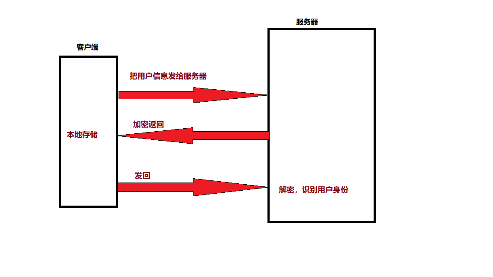

# Ajax笔记

[异步的js和xml]

- 它的作用就是通过js向服务器发送请求来加载数据
- xml是早期AJAX使用的数据格式:
  ```xml
  <student>
        <name>孙悟空</name>  
  </student>
  ```
- 目前数据格式都使用json
  `{"name" :"孙悟空"}`
- 发送请求可以选择的方案：
  - XMLHTTPRequest（xhr）
  - Fetch
  - Axios
  - [三者的关系](https://blog.csdn.net/m0_68359121/article/details/125212976?ops_request_misc=&request_id=&biz_id=102&utm_term=fetch%E3%80%81ajaxs%E5%92%8Caxios%E7%9A%84%E5%85%B3%E7%B3%BB&utm_medium=distribute.pc_search_result.none-task-blog-2~all~sobaiduweb~default-0-125212976.142^v70^control,201^v4^add_ask&spm=1018.2226.3001.4187)

## Rest风格

### 什么是rest?

- REpresentational State Transfer
  - 表示层状态的传输
- Rest实际上就是一种服务器的设计风格，它的主要特点就是服务器只返回数据
- 服务器和客户端传输数据时通常会使用JSON作为数据格式
- 请求的方法：
  - GET    加载数据
  - POST   新建或添加数据
  - PUT    添加或修改数据
  - PATCH  修改数据
  - DELETE 删除数据
  - OPTION 由浏览器自动发送，检查请求的一些权限
- API（接口）对于同个对象的操作，路由路径要统一
  - GET /user
  - POST /user
  - DELETE /user/:id
- 对比
  - 之前的服务器只能有两种路由(get&post)，只能通过路由路径来区分不同功能
  - 之前的服务器将数据渲染进页面，再将页面返回

### 为什么要用rest?

- 之前编写的服务器都是传统的服务器，服务器的结构是基于MVC模式
  - Model -- 数据模型
  - View -- 视图，用来呈现
  - Controller -- 控制器，复杂加载数据并选择视图来呈现数据
- 传统的服务器是直接为客户端返回一个页面
- 但是传统的服务器并不能适用于现在的应用场景
  - 现在的应用场景，一个应用通常都会有多个客户端存在：web端，移动端（app），pc端
- 如果服务器直接返回html页面，那么服务器就只能为web端提供服务，其他类型的客户端还需要单独开发服务器，这样就提高了开发和维护的成本

**如何解决这个问题？**

    传统的服务器需要做两件事情，第一个加载数据，第二个要将模型渲染进视图
	解决方案就将渲染视图的功能从服务器中剥离出来，服务器只负责向客户端返回数据，渲染视图的工作由客户端自行完成
	分离以后，服务器只提供数据，一个服务器可以同时为多种客户端提供服务，同时将视图渲染的工作交给客户端以后，简化了服务器代码的编写

## postman

    这是一个软件，通过它可以帮助向服务器发送各种请求，帮助我们测试API

## CORS (跨域资源共享)

### 跨域请求

- 如果网站的完整的域名不相同则就是跨域
- 跨域需要检查三个东西：
  - 协议
  - 域名
  - 端口号
- 三个只要有一个不同，就算跨域
- 当我们通过AJAX去发送跨域请求时,浏览器为了服务器的安全，会阻止JS读取到服务器的数据
- 解决方案
  - 在服务器中设置一个允许跨域的响应头 `Access-Control-Allow-Origin`
  - 允许那些客户端访问我们的服务器

[相关文档](https://developer.mozilla.org/en-US/docs/Web/HTTP/CORS)    [参考博客](https://blog.csdn.net/mijichui2153/article/details/121456386?ops_request_misc=%257B%2522request%255Fid%2522%253A%2522167301575716782425124260%2522%252C%2522scm%2522%253A%252220140713.130102334..%2522%257D&request_id=167301575716782425124260&biz_id=0&utm_medium=distribute.pc_chrome_plugin_search_result.none-task-blog-2~all~top_positive~default-1-121456386-null-null.nonecase&utm_term=%E5%90%8C%E6%BA%90%E7%AD%96%E7%95%A5&spm=1018.2226.3001.4187)

### 代码

```javascript
app.use((req, res, next) => {
    //设置响应头
    res.setHeader("Access-Control-Allow-Origin", "*")
    res.setHeader("Access-Control-Allow-Headers", "Content-type,Authorization")
    res.setHeader("Access-Control-Allow-Methods", "GET,POST,PUT,DELETE,PATCH")
    next()
})
```

- Access-Control-Allow-Origin 设置指定值时只能设置一个
- Access-Control-Allow-Methods 允许的请求的方式
- Access-Control-Allow-Headers 允许传递的请求头

## xhr

```javascript
//创建一个xhr对象
const xhr = new XMLHttpRequest()
//设置响应体的类型，设置后会自动对数据进行类型转换
xhr.responseType="json"
//给xhr绑定一个事件：当xhr中数据加载完毕
xhr.onload = function () {
    // xhr.status 表示响应状态码
    if (xhr.status === 200) {
        //读取响应信息
        // xhr.response 表示响应信息-
  
        //把返回的JSON字符串转换成JSON对象
        //const result=JSON.parse(xhr.response)
        const result=xhr.response
        if(result.status==="ok"){
	    console.log(result.data)
        }
    }
}
// 设置请求的信息
xhr.open("get", "http://localhost:3000/students")
//向服务器发送请求
xhr.send()
```

## fetch

- fetch是xhr的升级版，采用的是Promise API，服务器返回的数据会封装到promise里
- 作用和AJAX是一样的，但是使用起来更加友好
- fetch是原生js就支持的一种ajax请求的方式
- 示例1

  ```javascript
  fetch("http://localhost:3000/students", {
      method: "post",
      // 通过body去发送数据时，必须通过请求头来指定数据的类型
      body: JSON.stringify({
      }),
      // application/x-www-form-urlencoded 表单的形式
      headers:{"Content-type":"application/json"}
  })
  ```
- 示例2

  ```javascript
  fetch("http://localhost:3000/students")
  .then((res) => {
      if (res.status === 200) {
          console.log("fetch返回的Promise中存储的值:",res)
  	//res===Response {type: 'cors', url: 'http://localhost:3000/students', redirected: false, status: 200, ok: true, …}

  	//res.json()可以用来读取json格式的数据,把json格式的数据作为返回值
          return res.json()//{status: 'ok', data: ...}
      } else {
          throw new Error("加载失败")
      }
  })
  .then((res) => {
      if (res.status === "ok") {
          console.log(res.data)
      }
  })
  .catch((err) => {
      console.log("出错了", err)
  })
  ```
- 终止请求功能

  ```javascript
  let abController
  btn1.onclick=function(){
      //创建AbortController对象
      abController=new AbortController()
      fetch("http://localhost:3000/test",{
  	//把ac对象配置进fetch里
          signal:abController.signal
      })
  }
  btn2.onclick=function(){
      //调用ac.abort()终止请求
      abController&&abController.abort()
  }
  ```
- 使用await写法

  ```javascript
  btn03.onclick=async()=>{
     try{
        const res=await fetch(.....)
        const data=await res.json()
        console.log(data)
     }catch(e){
        console.log("出错了",e)
     }
  }
  ```

## jsonwebtoken

**如何告诉服务器客户端的登录状态?**

- rest风格的服务器是无状态的服务器，所以注意不要在服务器中存储用户的数据
- 服务器中不能存储用户信息，可以将用户信息发送给客户端保存
- 客户端每次访问服务器时，直接将用户信息发回，服务器就可以根据用户来识别用户的身份
- 但是如果将数据直接发送给客户端同样会有数据安全的问题，所以我们必须对数据进行加密，加密以后在发送给客户端保存，这样即可避免数据的泄露
- 在node中可以直接使用jsonwebtoken这个包来对数据进行加密
  - jsonwebtoken（jwt） -> 通过对json加密后，生成一个web中使用的令牌

**图解**



示例

```javascript
const jwt = require("jsonwebtoken")
const data = {
    name: "猪猪",
    age: 88,
    gender: "男"
}
//expiresIn:表示token存活时间,用数值单位是秒,用字符串要加单位(例如1天就是1d)
const token = jwt.sign(data, "1234", { expiresIn: "1h" })//加密(数据,密钥,配置对象)
console.log(token)
try {
    const decodeData = jwt.verify(token, "1234")//解密(令牌.密钥)
    console.log(decodeData)
} catch (e) {
    console.log("无效的token");
}

```

客户端在接收到token后，可以由以下方式发回：

```javascript
headers:{
	// "Bearer xxxxxx"
        "Authorization":`Bearer ${token}`
        }
```

## 本地存储

- 登录成功以后，为了保持用户的登录状态，需要将用户的信息存储到本地存储
- 所谓的本地存储就是指浏览器自身的存储空间，我们可以将用户的数据存储到浏览器内部
- 我们可以用浏览器的全局对象sessionStorage和 localStorage来实现

  - sessionStorage 中存储的数据，浏览器所在页面一关闭就会丢失
  - localStorage 不主动删除就会一直在
- 有以下方法:

  - setItem() 用来存储数据
  - getItem() 用来获取数据
  - removeItem() 删除数据
  - clear() 清空数据
- 不使用cookie的原因：

  - 跨域一般浏览器不会自动发送cookie,跨域接发cookie存在安全问题
  - 使用fetch发送的请求不会自带cookie,要配置起来操作繁琐

## axios

[api文档](https://www.axios-http.cn/)

- 在使用上与fetch的不同：
- 1.会自动转换json数据
  - 在发请求无须在请求头指定所发送数据的类型，axios会自动识别数据设置请求头
  - 在接收数据时，会把json字符串转换为json对象
- 2.使用axios发送请求，只有在响应状态码为2XX时才会走then,其余情况都会catch,这使得我们不用进行麻烦的响应状态码判断

示例

```javascript
btn.onclick=function(){
    axios({
        method:'post',
        url: "http://localhost:3000/students",
        data: {
            name:"珠珠",
            age:16,
            gender:"男",
            address:"大山"
        }
    }).then((result)=>{
        console.log(result)
    }).catch((e)=>{
        console.log("出错了",e)
    })
}
```

### 重要配置

```javascript
// baseURL 指定服务器的根目录（路径的前缀）
baseURL:"http://localhost:3000",
// 请求地址
url:"students",

// 请求方法，默认是get
method:"get",

// 指定请求头
// headers:{}

// 请求体
// data:"name=唐僧&age=16"
data: {
    name: "唐僧",
    age: 18,
    gender: "男",
    address: "女儿国"
},

// params 用来指定路径中的查询字符串
params:{
    id:1,
    name:"swk"
},

//timeout 过期时间
timeout:1000,

// 用来终止请求.用法与fetch相同
// signal


transformRequest:[function(data, headers){
    // 可以在函数中对data和headers进行修改
        data.name = "猪八戒"
        //headers["Content-Type"] = "application/json"
        return data
    }, function(data, headers){
        // 最后一个函数必须返回一个字符串，才能使得数据有效
        return JSON.stringify(data)
    }]
```

**transformRequest**

- 可以用来处理请求数据（data）
- 它需要一个数组作为参数，数组可以接收多个函数，请求发送时多个函数会按照顺序执行
- 函数在执行时，会接收到两个参数data和headers

### 默认配置

```javascript
axios.defaults.baseURL = "http://localhost:3000"
axios.defaults.headers.common[
    "Authorization"
] = `Bearer ${localStorage.getItem("token")}`
```

### aixos实例

- axios实例相当于是axios的一个副本，它的功能和axios一样
- axios的默认配置在实例也同样会生效，但是我们可以单独修改axios实例的默认配置
- 法1：

  ```javascript
  const instance = axios.create({ baseURL:"http://localhost:4000"})
  ```
- 法2

  ```javascript
  const instance=axios.create()
  instance.defaults.baseURL = "xxx"
  ```


### 响应拦截

**axios的拦截器可以对请求或响应进行拦截，在请求发送前和响应读取前处理数据**
