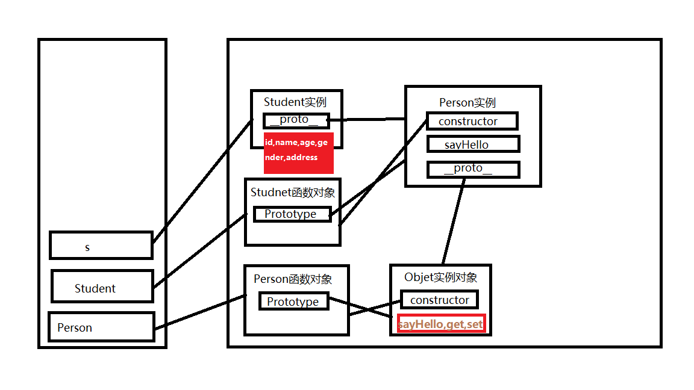
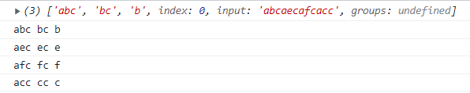

# JS基本语法学习总结

```
JS的重要思想是不报错，由于他是一门弱类型语言，所以很经常发生数据类型转换来保证代码不报错。
```

## 引入

### 编写位置

- js内部script标签
- 写在外部的js文件中
- 指定属性内

### 基本语法

- 多行注释

  - 注释中的内容会被解释器忽略
  - 可以通过注释来对代码进行解释说明
  - 也可以通过注释来注释掉不想执行的代码
- 单行注释
- JS严格区分大小写
- 在JS中多个空格和换行会被忽略，可以利用这个特点来对代码进行格式化
- JS中每条语句都应该以分号结尾， JS中具有自动添加分号的机制，所以如果不写分号解释器会自动添加

### 变量

```
声明变量 -> let 变量名 /const 变量名/var 变量名【没有块作用域，在块外仍可以访问】

变量赋值 -> a = xx

声明和赋值同时进行 -> let 变量 = 值

使用优先级：const>let>var
```

### 命名规范

在JS中，所有可以由我们自主命名的内容，都可以认为是一个标识符，像变量名 函数名 类名...

使用标识符需要遵循如下的命名规范：

- 标识符只能含有字母、数字、下划线、$，且不能以数字开头
- 标识符不能是JS中的关键字和保留字，也不建议使用内置的函数或类名作为变量名
- 命名规范：
  - 通常会使用驼峰命名法
    - 首字母小写，每个单词开头大写
  - 类名会使用大驼峰命名法
    - 首字母大写,每个单词开头大写
  - 常量的字母会全部大写

### 类型检查

```
typeof运算符返回全小写的字符串
```

## 数据类型

1.原始值

- Number

  - 大-->近似值 infinity无穷
  - 非法数值NaN
  - typeof->"number"
- BigInt  大整数

  - 大整数用来表示一些比较大的整数
  - 大整数使用n结尾，它可以表示的数字范围是无限大
  - typeof ->"bigint"
- 字符串

  - 模板字符串
  - typeof->"string"
- 布尔值

  - typeof->"boolean"
- 空值

  - typeof->"object"
- 未定义Undefined

  - typeof->"undefined"
- Symbol

  - typeof->"symbol"

2.对象

### 强制类型转换

- XXX->String

  - 调用toString()方法
    - undefined和null没有这个方法
  - 使用String(XXX)函数
    - 原理：
      - 对于拥有toString()方法的值调用String()函数时，实际上就是在调用toString()方法
      - 对于null，则直接转换为"null"
      - 对于undefined，直接转换为"undefined"
- XXX->Number

  - 调用Number()

    - 字符串：
      - 如果字符串是一个合法的数字，则会自动转换为对应的数字
      - 如果字符串不是合法数字，则转换为NaN （避免报错）
      - 如果字符串是空串或纯空格的字符串，则转换为0
    - 布尔值：
      - true转换为1，false转换为0
    - null 转换为 0
    - undefined 转换为 NaN
  - 专门用来将字符串转换为数值的两个方法

    - **parseInt() —— 将一个字符串转换为一个整数**
    - 解析时，会自左向右读取一个字符串，直到读取到字符串中所有的有效的整数
    - 也可以使用parseInt()来对一个数字进行取整
    - 传进数字，会把数字转换成字符串 ，再进行相关操作
    - **parseFloat() —— 将一个字符串转换为浮点数**
    - 解析时，会自左向右读取一个字符串，直到读取到字符串中所有的有效的小数
- XXX->Boolean，调用Boolean()函数

  - 所有表示空性的没有的错误的值都会转换为false：0、NaN、空串、null、undefined、false

### 隐式类型转换

```
1.算数运算符计算非字符串的加法->数值
2.某某+""->字符串
3.一元的+-操作非数值类型->数值
4.!!->布尔值
```

## 运算符

- 算数运算符（+，-，*，/...）

  - 算术运算时，除了字符串的加法，其他运算的操作数是非数值时，都会转换为数值然后再运算
- 赋值运算符（=，+=，-=...）

  - ?=空赋值
  - 只有当变量的值为null或undefined时才会对变量进行赋值
- 逻辑运算符（&&，||...）

  - 对于非布尔值进行与运算，它会转换为布尔值然后运算
    但是最终会返回原值
- 关系运算符（<，>...）

  - 当对非数值进行关系运算时，它会先将前转换为数值然后再比较
  - 当关系运算符的两端是两个字符串，它不会将字符串转换为数值，而是逐位的比较字符的Unicode编码
    - 利用这个特点可以对字符串按照字母排序
    - 注意：比较两个字符串格式的数字时一定要进行类型转换
- 相等运算符
  != ，==，!== ，===
- 其他运算符

  - 一元加减
  - 自增自减
  - 条件运算符
    - 条件表达式 ? 表达式1 : 表达式2

### 琐碎的函数

```
1.prompt()方法用于显示可提示用户进行输入的对话框。方法返回用户输入的字符串。
2.alert()弹出警告框
3.isNaN 判断是否是非法数字
4.console.log()控制台日志 console.time()开始计时器 console.timeEnd()结束计时器
```

## 流程控制

```
条件判断语句可以不是布尔值,JS会把条件自动转换成布尔值
```

## 对象

创建对象的语法 `let 对象名=Object()`可以不用加new

- 如果读取的是一个对象中没有的属性不会报错,而是返回undefined

### 属性名

- 通常属性名就是一个字符串，所以属性名可以是任何值，没有什么特殊要求。
  但是如果你的属性名太特殊了，不能直接使用，需要使用[]来设置。
  虽然如此，但是我们还是强烈建议属性名也按照标识符的规范命名。
- 也可以使用符号（symbol）作为属性名，来添加属性。
  获取这种属性时，也必须使用symbol。
  使用symbol添加的属性，通常是那些不希望被外界访问的属性。

  ```javascript
  let mySymbol = Symbol()
  obj[mySymbol] = "通过symbol添加的属性"
  ```
- 使用["属性名"]去操作属性时，可以使用变量。使用.的形式添加属性时，不能使用变量
- in 运算符

  - 用来检查对象中是否含有某个属性
  - 语法`属性名 in obj`如果有返回true，没有返回false

### 对象字面量

```
let 对象名={
            属性名:属性值,
            [属性名]:属性值,
            对象名:{},
            }
```

### 枚举属性

```
for(let 属性变量名 in 对象){
            语句...
    }
```

### 方法

```
当一个对象的属性指向一个函数，那么我们就称这个函数是该对象的方法，调用函数就称为调用对象的方法
```

## 函数

### 函数（Function）

- 函数也是一个对象，它具有其他对象所有的功能

  - 函数中可以存储代码，且可以在需要时调用这些代码
- 使用typeof检查函数对象时会返回function

### 函数的定义方式

- 函数声明

  ```javascript
  function 函数名(){
  语句...
  }
  ```
- 函数表达式

  ```javascript
  const 变量 = function(){
  语句...
  }
  ```
- 箭头函数

  ```javascript
  () => {
  语句...
  }
  ```

  - 只有一个语句，箭头函数的大括号可以省略不写
  - 只有一个参数，箭头函数的参数括号可省略
  - 没有自己的this和arguments，不能作为构造函数调用
  - 无法通过call、apply、bind指定函数的this

### 参数

- 如果实参和形参数量相同，则对应的实参赋值给对应的形参
- 如果实参多余形参，则多余的实参不会使用
- 如果形参多余实参，则多余的形参为undefined
- 参数的类型
  - JS中不会检查参数的类型，可以传递任何类型的值作为参数
  - 定义参数时，可以为参数指定默认值
  - 默认值会在没有对应实参时生效
  - ```javascript
    const fn = (a=10, b=20, c=30) => {
          console.log("a =", a);
          console.log("b =", b);
          console.log("c =", c);
    }
    ```

### 函数返回值

- 如果return后不跟任何值，则相当于返回undefined
- 如果不写return，那么函数的返回值依然是undefined
- 箭头函数的返回值可以直接写在箭头后
  - 如果直接在箭头后设置对象字面量为返回值时，对象字面量必须使用()括起来,不然会当成代码块

### window对象

- 在浏览器中，浏览器为我们提供了一个window对象，可以直接访问
- window对象代表的是浏览器窗口，通过该对象可以对浏览器窗口进行各种操作
- 除此之外window对象还负责存储JS中的内置对象和浏览器的宿主对象
  - window对象的属性可以通过window对象访问，也可以直接访问
  - 函数就可以认为是window对象的方法
- var 用来声明变量，作用和let相同，但是var不具有块作用域
  - 在全局中使用var声明的变量，都会作为window对象的属性保存
  - 使用function声明的函数，都会作为window的方法保存
  - 使用let声明的变量不会存储在window对象中，而存在一个秘密的小地方（无法访问）
  - var虽然没有块作用域，但有函数作用域
  - 在局部作用域中，如果没有使用var或let声明变量，则变量会自动成为window对象的属性，也就是全局变量

### 提升

- 变量的提升

  - 使用var声明的变量，它会在所有代码执行前被声明(提升是声明，不是赋值)
    所以我们可以在变量声明前就访问变量
- 函数的提升

  - 使用函数声明创建的函数，会在其他代码执行前被创建
    所以我们可以在函数声明前调用函数

let声明的变量实际也会提升，但是在赋值之前解释器禁止对该变量的访问

### debug

在网页开发者工具源代码中debug，打下断点后添加监视点

### 立即执行函数

在开发中应该尽量减少直接在全局作用域中编写代码！

所以我们的代码要尽量编写的局部作用域。

如果使用let声明的变量，可以使用{}来创建块作用域。

立即执行函数（IIFE）

- 立即是一个匿名的函数，并且它只会调用一次
- 可以利用IIFE来创建一个一次性的函数作用域，避免变量冲突的问题

```javascript
(function(){   
   document.write("立即执行函数")   
}());
```

### this

- 函数在执行时，JS解析器每次都会传递进一个隐含的参数：this
  - this会指向一个对象，所指向的对象会根据函数调用方式的不同而不同
    - 以函数形式调用时，this指向的是window
    - 以方法的形式调用时，this指向的是调用方法的对象
  - 通过this可以在方法中引用调用方法的对象
  - **箭头函数没有自己的this，它的this由外层作用域决定，箭头函数的this和它的调用方式无关**

### 严格模式

```javascript
"use strict" // 全局的严格模式
function fn(){
    "use strict" // 函数的严格的模式
}
```

## 面向对象

### 类

```javascript
class 类名 {}

const 类名 = class {}
```

### 方法

```javascript
sayHello = function(){}
sayHello(){}

//静态方法（类方法） 通过类来调用静态方法中this指向的是当前类

static sayHello(){}
```

### 构造函数

```javascript
constructor(属性名....){}
```

### 封装

- 实现封装的方式：
  - 属性私有化，属性名加#
  - 通过getter和setter方法来操作属性

    ```javascript
    get 属性名(){
    return this.#属性
    }

    ```

    ```javascript
    set 属性名(参数){
    this.#属性 = 参数
    }
    ```

### 多态

- 在JS中不会检查参数的类型，所以这就意味着任何数据都可以作为参数传递
- 要调用某个函数，无需指定的类型，只要对象满足某些条件即可

### 继承

- OCP 开闭原则
  - 程序应该对修改关闭，对扩展开放
  - 子类可以重写父类的同名方法
  - 子类重写构造函数，需要在里面`super(...)`调用下父类的构造器

### 对象的结构

对象中存储属性的区域实际有两个：

- 对象自身

  - 直接通过对象所添加的属性，位于对象自身中
  - 在类中通过 x = y 的形式添加的属性，位于对象自身中
- 原型对象（prototype）

  - 对象中还有一些内容，会存储到其他的对象里（原型对象）
  - 在对象中会有一个属性用来存储原型对象，这个属性叫做__proto__（隐式原型）
  - 原型对象也负责为对象存储属性，当我们访问对象中的属性时，会优先访问对象自身的属性，对象自身不包含该属性时，才会去原型对象中寻找
  - 会添加到原型对象中的情况：

    - 在类中通过xxx(){}方式添加的方法，位于原型中
    - 主动向原型中添加的属性或方法

### 原型对象

访问一个对象的原型对象：

- 对象.\_\_proto\_\_
- Object.getPrototypeOf(对象)
- 类.prototype

#### 原型对象中的数据

1. 对象中的数据（属性、方法等）
2. constructor （对象的构造函数）【也就是类本身】

注意：
原型对象也有原型，这样就构成了一条原型链（隐式原型链），根据对象的复杂程度不同，原型链的长度也不同
原型链：

- 读取对象属性时，会优先对象自身属性，如果对象中有，则使用，没有则去对象的原型中寻找
- 如果原型中有，则使用，没有则去原型的原型中寻找
- 直到找到Object对象的原型（Object的原型没有隐式原型（为null））
- 如果依然没有找到，则返回undefined
- 原型链，是找属性的链，找不到会返回undefined

作用域链：

- 是找变量的链，找不到会报错

#### 原型的作用

1. 所有的同类型对象它们的原型对象都是同一个,也就意味着，同类型对象的原型链是一样的
2. 原型就相当于是一个公共的区域，可以被所有该类实例访问，可以将该类实例中，所有的公共属性（方法）统一存储到原型中
   (这样我们只需要创建一个属性，即可被所有实例访问)
3. JS中继承就是通过原型来实现的。
   当继承时，子类的原型就是一个父类的实例。
   在对象中有些值是对象独有的，像属性（name，age，gender）每个对象都应该有自己值，
   但是有些值对于每个对象来说都是一样的，像各种方法，对于一样的值没必要重复的创建。

```javascript
class Person{
    #name;
    #age;
    #gender;
    address;
    constructor(name, age, gender,address) {
        this.#name = name;
        this.#age = age;
        this.#gender = gender;
        this.address=address
    }
    getName() {
        return this.#name;
    }
    setName(name) {
        this.#name = name;
    }
    sayhello() {
        console.log("P:hello")
    }
}
class Student extends Person{
    #id;
    constructor(id,name,age,gender,address){
        super(name,age,gender,address)
        this.#id=id
    }
    sayhello(){
        console.log("S:hello")
    }
}
```



- Person实例中sayHello是子类重写的
- 构造函数的显示原型=实例对象的隐式原型
- 子类的显示原型=父类实例

#### 修改原型

- 大部分情况下，我们是不需要修改原型对象
- 注意：千万不要通过类的实例去修改原型
  - 通过一个对象影响所有同类对象，这么做不合适
  - 修改原型先得创建实例，麻烦
  - 危险
- 修改原型时，最好通过通过类去修改`类.prototype`
  - 好处：
    - 一修改就是修改所有实例的原型
    - 无需创建实例即可完成对类的修改

原则：

1. 原型尽量不要手动改
2. 要改也不要通过实例对象去改
3. 通过 类.prototype 属性去修改
4. 最好不要直接给prototype去赋值

### instanceof和hasOwn

- instanceof 用来检查一个对象是否是一个类的实例

  - instanceof检查的是对象的原型链上是否有该类实例，只要原型链上有该类实例，就会返回true
- in

  - 使用in运算符检查属性时，无论属性在对象自身还是在原型中，都会返回true
- 对象.hasOwnProperty(属性名) (不推荐使用)

  - 用来检查一个对象的自身是否含有某个属性
- Object.hasOwn(对象, 属性名)

  - 用来检查一个对象的自身是否含有某个属性

### 旧类

早期JS中，直接通过函数来定义类

- 一个函数如果直接调用 xxx() 那么这个函数就是一个普通函数
- 一个函数如果通过new调用 new xxx() 那么这个函数就是一个构造函数
- 了解旧类的写法与原理
  ```javascript
  var Person = (function () {
      function Person(name, age) {
          // 在构造函数中，this表示新建的对象
          this.name = name
          this.age = age

          // this.sayHello = function(){
          //     console.log(this.name)
          // }
      }

      // 向原型中添加属性（方法）
      Person.prototype.sayHello = function () {
          console.log(this.name)
      }

      // 静态属性
      Person.staticProperty = "xxx"
      // 静态方法
      Person.staticMethod = function () {}

      return Person
  })()

  const p = new Person("孙悟空", 18)
  ```

### new运算符

- 当使用new去调用一个函数时，这个函数将会作为构造函数调用
- 使用new调用函数时，将会发生这些事：
  1. 创建一个普通的JS对象（Object对象 {}）, 为了方便，称其为新对象
  2. 新对象的隐式原型=构造函数的显示原型
  3. 使用实参来执行构造函数，并且将新对象设置为函数中的this
  4. 如果构造函数返回的是一个非原始值，则该值会作为new运算的返回值返回（千万不要这么做）
     如果构造函数的返回值是一个原始值或者没有指定返回值，则新的对象将会作为返回值返回
     通常不会为构造函数指定返回值

### 总结

对象的分类：

- 内建对象
  - 由ES标准所定义的对象
  - 比如 Object Function String Number ....
- 宿主对象
  - 由浏览器提供的对象：BOM、DOM(window\document)
- 自定义对象
  - 由开发人员自己创建的对象

## 数组

- 数组也是一种复合数据类型，在数组可以存储多个**不同类型**的数据
- 创建数组：通过Array()来创建数组，也可以通过[]来创建数组
- 如果读取了一个不存在的元素，不会报错而是返回undefined
- length是可以修改的，也就是说数组的大小可以任意修改

### 遍历数组

```
for-of语句可以用来遍历可迭代对象
语法：
	for(变量 of 可迭代的对象){
                    语句...
     }
类似java的foreach语句
```

### 数组中的常用方法

- Array.isArray(对象)//用来检查一个对象是否是数组
- at() //可以根据索引获取数组中的指定元素

  - 可以接收负索引作为参数  (最后一个元素为-1)
- concat()//用来连接两个或多个数组

  - 非破坏性方法，不会影响原数组，而是返回一个新的数组
- indexOf()//获取元素在数组中第一次出现的索引

  - 参数：
    1. 要查询的元素
    2. 查询的起始位置
- lastIndexOf()//获取元素在数组中最后一次出现的位置

  - 返回值：找到了则返回元素的索引，没有找到返回-1
- join()

  - 将一个数组中的元素连接为一个字符串，并返回
  - ["孙悟空", "猪八戒", "沙和尚", "唐僧", "沙和尚"]-> "孙悟空,猪八戒,沙和尚,唐僧,沙和尚"
  - 参数：指定一个字符串作为连接符
- slice()//用来截取数组（非破坏性方法）

  - 参数：

    1. 截取的起始位置（包括该位置）
    2. 截取的结束位置（不包括该位置）
       - 第二个参数可以省略不写，如果省略则会一直截取到最后
       - 索引可以是负值

    - 如果将两个参数全都省略，则可以对数组进行浅拷贝（浅复制）
- push()//向数组的末尾添加一个或多个元素，并返回新的长度
- pop()//删除并返回数组的最后一个元素
- unshift()//向数组的开头添加一个或多个元素，并返回新的长度
- shift()//删除并返回数组的第一个元素
- splice()

  - 可以删除、插入、替换数组中的元素
  - 参数：
    1. 删除的起始位置
    2. 删除的数量
    3. 要插入的元素
  - 返回值：被删除的元素
- reverse()反转数组
- sort()

  - sort用来对数组进行排序（会对改变原数组）
  - sort默认会将数组升序排列
    注意：sort默认会把数组的元素转换成字符串再按照Unicode编码进行排序，所以如果直接通过sort对数字进行排序可能会得到一个不正确的结果
  - 参数：
    - 可以传递一个回调函数作为参数，通过回调函数来指定排序规则
      (a, b) => a - b 升序排列
      (a, b) => b - a 降序排列
- forEach()

  - 用来遍历数组
  - 它需要一个回调函数作为参数，这个回调函数会被调用多次
    数组中有几个元素，回调函数就会调用几次
    每次调用，都会将数组中的数据作为参数传递
  - 回调函数中有三个参数：
    - element 当前的元素
    - index 当前元素的索引
    - array 被遍历的数组
- filter()

  - 将数组中符合条件的元素保存到一个新数组中返回
  - 需要一个回调函数作为参数，会为每一个元素去调用回调函数，并根据返回值来决定是否将元素添加到新数组中
  - 非破坏性方法，不会影响原数组
- map()

  - 根据当前数组生成一个新数组
  - 需要一个回调函数作为参数，回调函数的返回值会成为新数组中的元素
  - 非破坏性方法不会影响原数组
- reduce()

  - 可以用来将一个数组中的所有元素整合为一个值
  - 参数：
    1. 回调函数，通过回调函数来指定合并的规则
    2. 可选参数，初始值
- find(回调函数)

  - 返回符合条件的一个数组元素

  ```html
  <script>
      const arr=[1,2,3,4];
      arr.shift();
      console.log(arr)//[2,3,4]
      let len=arr.unshift(1,1);
      console.log(arr)//[1,1,2,3,4]
      const arr2=arr.splice(1,2,"h1");
      console.log(arr)//[1,'h1',3,4]
      console.log(arr2);//[1,2]
      const arr3=[2,6,3,5,2,1,2,2,9,10];
      arr3.sort((a,b)=>a-b);
      console.log(arr3)//[1, 2, 2, 2, 2, 3, 5, 6, 9, 10]
      arr3.forEach((element,index)=>console.log(index,element));
      let result=arr3.filter(element=>element>3);
      console.log(result);//[5, 6, 9, 10]
      result=arr3.map(element=>element*3);
      console.log(result);// [3, 6, 6, 6, 6, 9, 15, 18, 27, 30]
      result=arr3.reduce((a,b)=>a+b,20);
      console.log(result);//62=所有值之和加上20
  </script>
  ```

### 浅拷贝与深拷贝

- 浅拷贝是创建一个新对象，这个对象有着原始对象属性值的一份精确拷贝。
  如果属性是基本类型，拷贝的就是基本类型的值，如果属性是引用类型，拷贝的就是内存地址。
- 深拷贝是将一个对象从内存中完整的拷贝一份出来,从堆内存中开辟一个新的区域存放新对象。
- 区别：浅拷贝基本类型之前互不影响，引用类型其中一个对象改了地址，就会影响另一个对象。深拷贝改变新对象不会影响原对象，他们之前互不影响。

```javascript
const arr3 = structuredClone(arr) // 专门用来深拷贝的方法
```

##### ... (展开运算符)

- 可以将一个数组中的元素展开到另一个数组中或者作为函数的参数传递
- 通过它也可以对数组进行浅复制

#### 对象的复制

- Object.assign(目标对象, 被复制的对象)[浅拷贝]
- 将被复制对象中的属性复制到目标对象里，并将目标对象返回
- 也可以使用展开运算符对对象进行复制

  ```javascript
  const obj3 = { address: "高老庄", ...obj, age: 48 }

  let obj1 = { name: '孙悟空', age: 18 };
  let obj2 = { name: '猪八戒', address: '高老庄' };
  let mergedObj = { ...obj1, ...obj2 }; // 合并两个对象
  // Object {name: '猪八戒', age: 18, address: '高老庄'}
  ```

## 函数高级

### CB

- 一个函数的参数也可以是函数，如果将函数作为参数传递，那么我们就称这个函数为回调函数（callback）
- [java中用lambda表达式来实现函数作为参数传递](https://blog.csdn.net/qq_25073223/article/details/125809809)

高阶函数

- 如果一个函数的参数或返回值是函数，则这个函数就称为高阶函数
- 为什么要将函数作为参数传递？（回调函数有什么作用？）
  - 将函数作为参数，意味着可以对另一个函数动态的传递代码
  - 通常回调函数都是匿名函数

### 闭包

- 闭包就是能访问到外部函数作用域中变量的函数
- 什么时候使用：当我们需要隐藏一些不希望被别人访问的内容时就可以使用闭包
- 构成闭包的要件：

  1. 函数的嵌套
  2. 内部函数要引用外部函数中的变量
  3. 内部函数要作为返回值返回
- 函数的作用域

  - 在函数创建时就已经确定的（词法作用域）和调用的位置无关
  - 函数在全局作用域创建，那么它的外层作用域就是全局作用域
  - 闭包利用的就是词法作用域
- 闭包的生命周期：

  - 闭包在外部函数调用时产生，外部函数每次调用都会产生一个全新的闭包
  - 在内部函数丢失时销毁（内部函数被垃圾回收了，闭包才会消失）
- 注意事项：

  - 闭包主要用来隐藏一些不希望被外部访问的内容,这就意味着闭包需要占用一定的内存空间
  - 相较于类来说，闭包比较浪费内存空间（类可以使用原型而闭包不能），
  - 需要执行次数较少时，使用闭包
  - 需要大量创建实例时，使用类

### 可变参数

arguments

- arguments是函数中的一个隐含参数
- arguments是一个类数组对象（伪数组）
  和数组相似，可以通过索引来读取元素，也可以通过for循环变量，
  但是它不是一个数组对象，不能调用数组的方法
- arguments用来存储函数的实参，无论用户是否定义形参，实参都会存储到arguments对象中
- 可以通过该对象直接访问实参
- ```javascript
  function fu(){
     console.log(arguments);
  }
  fu(1,2,4);
  ```

可变参数，在定义函数时可以将参数指定为可变参数

- 可变参数可以接收任意数量实参，并将他们统一存储到一个数组中返回
- 可变参数的作用和arguments基本是一致，但是也具有一些不同点：
  1. 可变参数的名字可以自己指定
  2. 可变参数就是一个数组，可以直接使用数组的方法
  3. 可变参数可以配合其他参数一起使用
  4. 当可变参数和普通参数一起使用时，需要将可变参数写到最后
- ```javascript
  function fu1(...a){
      return a.reduce((a,b)=>a+b,0);
  }
  let result=fu1(1,2,3,4,5);
  console.log(result);//15
  ```

### call、apply和bind

根据函数调用方式的不同，this的值也不同：

1. 以函数形式调用，this是window
2. 以方法形式调用，this是调用方法的对象
3. 构造函数中，this是新建的对象
4. 箭头函数没有自己的this，由外层作用域决定,外层this是谁,他的this就是谁
5. 通过call和apply调用的函数，它们的第一个参数就是函数的this
6. 通过bind返回的函数，this由bind第一个参数决定（且this无法修改）

调用函数除了通过 函数() 这种形式外，还可以通过其他的方式来调用函数

- 比如，我们可以通过调用函数的call()和apply()两个个方法来调用函数

  ```javascript
  函数.call() [函数对象.方法]
  函数.apply()
  ```
- call 和 apply除了可以调用函数，还可以用来指定函数中的this
- call和apply的第一个参数，将会成为函数的this
- 通过call方法调用函数，函数的实参直接在第一个参数后一个一个的列出来
- 通过apply方法调用函数，函数的实参需要通过一个数组传递

bind() 是函数的方法，可以用来创建一个新的函数并返回

- bind可以为新函数绑定this
- bind可以为新函数绑定参数，参数排列非数组

箭头函数没有自身的this，它的this由外层作用域决定，也无法通过call、apply和bind修改它的this
箭头函数中没有arguments

## 解构

### 数组

```javascript
let a, b, rest;
[a, b] = [10, 20]; // 第一个元素给a，第二个元素给b
console.log(a); // 10
console.log(b); // 20

[a, , b] = [10, 20, 30]; // 第一个元素给a，第三个元素给b，中间空出一个
console.log(a); // 10
console.log(b); // 30

[a, b, ...rest] = [10, 20, 30, 40, 50]; // 第一个元素给a，第二个元素给b，剩下的给rest
console.log(a); // 10
console.log(b); // 20
console.log(rest); // [30, 40, 50]

const [d, e, f] = [40, 50, 60] // 可以在赋值时直接声明变量
console.log(d); // 40
console.log(e); // 50
console.log(f); // 60

[a=5, b=7] = [1]; // 赋值是可以指定默认值
console.log(a); // 1
console.log(b); // 7
```

1.默认值是undefined，可以设置默认值
2.解构数组时，可以使用...来设置获取多余的元素
3.可以通过解构赋值来快速交换两个变量的值

### 对象

1.let { name, age, gender } = obj //声明变量同时解构对象
2.先声明再解构会产生语法错误，误以为{代码块}=obj ，需要外层加个括号
3.变量得同属性名才能解构，不同于属性名会返回undefined

```javascript
let a, b;
({ a, b } = { a: 10, b: 20 }); //属性a赋值给变量a，属性b赋值给变量b
console.log(a); // 10
console.log(b); // 20

({a, b, ...rest} = {a: 10, b: 20, c: 30, d: 40}); //属性a赋值给变量a，属性b赋值给变量b，其余的保存到rest中
console.log(a); // 10
console.log(b); // 20
console.log(rest); // {c: 30, d: 40}

({a = 10, b = 5} = {a: 3}); // 可以指定默认值
console.log(a); // 3
console.log(b); // 5

const {name, age} = {name:'孙悟空', age:18}; // 对象解构时如果使用const、let、var开头，可以不加()
console.log(name); // 孙悟空
console.log(age); // 18

//可以使用起别名和指定默认值让解构更灵活  【：后面是变量名】
let {name:a} ={name:孙悟空}
console.log(a)//孙悟空

const {len: width} = {len:100}; // 将对象的len属性值赋值给变量width
console.log(width); // 100

const {inner:{size}} = {a: 10, b: 20, inner:{size: 5}}; // 将对象中inner.size赋值给变量size
console.log(size) // 5

const {inner:{size:mySize}} = {a: 10, b: 20, inner:{size: 5}}; // 将对象中inner.size赋值给变量mySize
console.log(mySize); // 5
```

## 对象可序列化

- JS中的对象使用时都是存在于计算机的内存中的
- 序列化指将对象转换为一个可以存储的格式【可以存储到外存里】
  在JS中对象的序列化通常是将一个对象转换为字符串（JSON字符串）
- 序列化的用途（对象转换为字符串有什么用）：
  - 对象转换为字符串后，可以将字符串在不同编程语言之间进行传递
    甚至人可以直接对字符串进行读写操作，使得JS对象可以在不同编程语言之间传递
  - 用途：

    1. 作为数据交换的格式
    2. 用来编写配置文件
  - 如何进行序列化：

    - 在JS中有一个工具类 JSON （JavaScript Object Notation)
      ```javascript
      JSON.stringify() //可以将一个对象转换为JSON字符串
      ```
    - JS对象序列化后会转换为一个字符串，这个字符串我们称其为JSON字符串
      ```javascript
      JSON.parse() //可以将一个JSON格式的字符串转换为JS对象
      ```
    - 也可以手动的编写JSON字符串，在很多程序的配置文件就是使用JSON编写的
  - 编写JSON的注意事项：

    1. JSON字符串有两种类型：
       JSON对象 {}
       JSON数组 []
    2. JSON字符串的属性名必须使用双引号引起来
    3. JSON中可以使用的属性值（元素）

    - 数字（Number）
    - 字符串（String）必须使用双引号
    - 布尔值（Boolean）
    - 空值（Null）
    - 对象（Object {}）
    - 数组（Array []）

    4. JSON的格式和JS对象的格式基本上一致的，
       注意：JSON字符串如果属性是最后一个，则不要再加,

补充：

```javascript
//能使用JSON实现深复制：
const obj2 = JSON.parse(JSON.stringify(obj))
```

## 内建对象

### Map

- Map用来存储键值对结构的数据（key-value）
- Object中存储的数据就可以认为是一种键值对结构
- Map和Object的主要区别：
  - Object中的属性名只能是字符串或符号，如果传递了一个其他类型的属性名，JS解释器会自动将其转换为字符串
  - Map中任何类型的值都可以称为数据的key

#### 使用

- 创建：const map=new Map()
- 属性和方法：

  ```javascript
  map.size() //获取map中键值对的数量
  map.set(key, value) //向map中添加键值对
  map.get(key) //根据key获取值
  map.delete(key) //删除指定数据
  map.has(key) //检查map中是否包含指定键
  map.clear() //删除全部的键值对
  map.keys() //获取map的所有的key
  map.values() //获取map的所有的value
  map.forEach((key,value)=>{...}) //遍历map
  Array.from(map)
  [...map] //将map转换为数组
  ```

  ```javascript
  const m=new Map();
  m.set(NaN,0);
  m.set(undefined,-1);
  m.set("name","小米");
  let keys=m.keys();
  console.log(keys);
  let values=m.values();
  console.log(values);
  let array=Array.from(m);
  console.log(array)
  //遍历
  for(const entry of m){
      console.log(entry);
  }
  //解构遍历
  for(const[key,value]of m){
      console.log(key,value);
  }
  m.forEach((key,value)=>{
      console.log(key,value);
  })
  ```

### Set

- Set用来创建一个集合
- 它的功能和数组类似，不同点在于Set中不能存储重复的数据,可以利用这一点帮助数组去重

#### 使用

- 创建

  - new Set()
  - new Set(iterable)//iterable可迭代对象
- 方法

  ```javascript
  size()//获取数量
  add()//添加元素
  has()//检查元素
  delete()//删除元素
  [...set]//转换为数组
  ```

### Math

- Math一个工具类
- Math中为我们提供了数学运算相关的一些常量和方法

#### 使用

- 常量：
  Math.PI 圆周率
- 方法：
  ```javascript
  Math.abs() //求一个数的绝对值
  Math.min() //求多个值中的最小值
  Math.max() //求多个值中的最大值
  Math.pow() //求x的y次幂
  Math.sqrt() //求一个数的平方根
  Math.floor() //向下取整
  Math.ceil() //向上取整
  Math.round() //四舍五入取整
  Math.trunc() //直接去除小数位
  Math.random() //生成一个0-1之间的随机数
  ```

### Date

- 在JS中所有的和时间相关的数据都由Date对象来表示

#### 使用

- 创建：new Date()
  - 直接通过new Date()创建时间对象时，它创建的是当前的时间的对象
  - 可以在构造函数中传递一个表示时间的字符串【不推荐】
  - 字符串的格式：月/日/年 时:分:秒 ，年-月-日T时:分:秒
- 方法
  ```javascript
  getFullYear() //获取4位年份
  getMonth() //返当前日期的月份（0-11）
  getDate() //返回当前是几日
  getDay() //返回当前日期是周几（0-6） 0表示周日
  getTime() //返回当前日期对象的时间戳
  /*时间戳：自1970年1月1日0时0分0秒到当前时间所经历的毫秒数,
  计算机底层存储时间时，使用都是时间戳*/
  Date.now() //获取当前的时间戳
  ```

#### 日期的格式化

- 2023年1月28号 15：33：02
- date.toLocaleDateString()//只转日期

  - 2023/1/18
- date.toLocaleTimeString()//只转时间

  - 15:33:02
- date.toLocaleString()//可以将一个日期转换为本地时间格式的字符串
- 参数：

1. 描述语言和国家信息的字符串
   - zh-CN 中文中国
   - zh-HK 中文香港
   - en-US 英文美国
2. 需要一个对象作为参数，在对象中可以通过对象的属性来对日期的格式进行配置
   - 方式1：dateStyle 日期的风格，timeStyle 时间的风格：
     - 可选值
       - full
       - long
       - medium
       - short
   - 方式2：{year,month,day,weekday,hour,minute,second}给各属性赋值
     - weekday 星期的显示方式：long，short，narrow
     - hour12 是否采用12小时值：true，false
     - 不写就不显示

- [文档](https://developer.mozilla.org/en-US/docs/Web/JavaScript/Reference/Global_Objects/Intl/DateTimeFormat/DateTimeFormat)

### 包装类

在JS中，除了直接创建原始值外，也可以创建原始值的对象

- 通过 new String() 可以创建String类型的对象
- 通过 new Number() 可以创建Number类型的对象
- 通过 new Boolean() 可以创建Boolean类型的对象
- 但是千万不要这么做，这么做不便于随时随地类型转换，抹杀了js语法的最大特点

JS中一共有5个包装类：

- String --> 字符串包装为String对象
- Number --> 数值包装为Number对象
- Boolean --> 布尔值包装为Boolean对象
- BigInt --> 大整数包装为BigInt对象
- Symbol --> 符号包装为Symbol对象
- 通过包装类可以将一个原始值包装为一个对象，当我们对一个原始值调用方法或属性时，JS解释器会临时将原始值包装为对应的对象然后调用这个对象的属性或方法
  （自动装箱）
- 由于原始值会被临时转换为对应的对象，这就意味着对象中的方法都可以直接通过原始值来调用

### String

- 字符串其本质就是一个字符数组
- "hello" --> ["h", "e", "l", "l", "o"]
- 字符串的很多方法都和数组是非常类似的

#### 属性和方法：

```javascript
length
    - 获取字符串的长度
str[索引]
    -获取指定位置的字符
str.at()
    - 根据索引获取字符，可以接受负索引
str.charAt()
    - 根据索引获取字符
str.concat()
    - 用来连接两个或多个字符串
str.includes()
    - 用来检查字符串中是否包含某个内容，有返回true，没有返回false
str.indexOf()
str.lastIndexOf()
    - 查询字符串中是否包含某个内容,根据内容返回索引
str.startsWith()
    - 检查一个字符串是否以指定内容开头
str.endsWith()
    - 检查一个字符串是否以指定内容结尾
str.padStart()
str.padEnd()
    - 通过添加指定的内容，使字符串保持某个长度
str.replace()
    - 使用一个新字符串替换一个指定内容
str.replaceAll()
    - 使用一个新字符串替换所有指定内容
str.slice()
    - 对字符串进行切片
str.substring()
    - 截取字符串
str.split()
    - 用来将一个字符串拆分为一个数组
str.toLowerCase()
    - 将字符串转换为小写
str.toUpperCase()
    - 将字符串转换为大写
str.trim()
    - 去除前后空格
str.trimStart()
    - 去除开始空格
str.trimEnd()
    - 去除结束空格
```

## 正则表达式

- 正则表达式用来定义一个规则
- 通过这个规则计算机可以检查一个字符串是否符合规则，或者将字符串中符合规则的内容提取出来
- 正则表达式也是JS中的一个对象，所以要使用正则表达式，需要先创建正则表达式的对象

### 创建方式

- new RegExp()
  - 可以接收两个参数（字符串） 1.正则表达式 2.匹配模式
  - 可以传参数，动态生成正则表达式
  - 使用转义字符\比较麻烦
    ```javascript
    let reg = new RegExp("\\w", "i")
    ```
- 使用字面量来创建正则表达式：/正则/匹配模式
  ```javascript
  let reg = /a/i
  ```

### 使用

```
1.在正则表达式中大部分字符都可以直接写
2.| 在正则表达式中表示或
3.[] 表示或（字符集）
    [a-z] 任意的小写字母
    [A-Z] 任意的大写字母
    [a-zA-Z] 任意的字母
    [0-9]任意数字
4.[^] 表示除了
    [^x] 除了x  只要匹配到除了x的所有字符都会返回ture
5. . 表示除了换行外的任意字符
6. 在正则表达式中使用\作为转义字符
7. 其他的字符集
    \w 任意的单词字符 [A-Za-z0-9_]
    \W 除了单词字符 [^A-Za-z0-9_]
    \d 任意数字 [0-9]
    \D 除了数字 [^0-9]
    \s 空格
    \S 除了空格
    \b 单词边界
    \B 除了单词边界
8. 开头和结尾
    ^ 表示字符串的开头 
    $ 表示字符串的结尾 
    ^X$ 完全匹配，要求字符串和正则表达式完全匹配
9.量词 只匹配前一个字符，要匹配多个字符（……){量词}
    {m} 正好m个
    {m,} 至少m个
    {m,n} m到n个
     + 一个以上，相当于{1,}
     * 任意数量的a
     ? 0-1次 {0,1}
10.匹配模式
     i忽略大小写
     g全局模式匹配
```

- 正则表达式.test(#字符串)检查字符串是否符合，返回ture/false
- 正则表达式.exec(#字符串) 获取字符串中符合正则表达式的内容，返回数组（可以通过在正则表达式里加括号的方式进行分组）

  - 不开全局模式此方法只会匹配第一个
  - 开了之后调一次匹配一个，下次调用从上次匹配的结尾开始

  ```javascript
  let str = "abcaecafcacc"

  // 提取出str中符合axc格式的内容
  let re = /a(([a-z])c)/ig

  let result = re.exec(str)

  console.log(result)

  while(result){
      console.log(result[0], result[1], result[2])
      result = re.exec(str)
  }
  ```

  

### 字符串与正则表达式

```javascript
split()
    - 可以根据正则表达式来对一个字符串进行拆分
search()
    - 可以去搜索符合正则表达式的内容第一次在字符串中出现的位置
replace()
    - 根据正则表达式替换字符串中的指定内容
match()
    - 根据正则表达式去匹配字符串中符合要求的内容
    - 返回字符串
matchAll()
    - 根据正则表达式去匹配字符串中符合要求的内容(必须设置g 全局匹配)
    - 它返回的是一个迭代器
```

## 垃圾回收

- 在程序的世界中，什么是垃圾？
- 如果一个对象没有任何的变量对其进行引用，那么这个对象就是一个垃圾
- 垃圾对象的存在，会严重的影响程序的性能
- 在JS中有自动的垃圾回收机制，这些垃圾对象会被解释器自动回收，我们无需手动处理
- 对于垃圾回收来说，我们唯一能做的事情就是将不再使用的变量设置为null

## DOM

- Document Object Model
- 文档对象模型，通过DOM可以来任意来修改网页中各个内容，DOM把JS与网页联系起来
- 文档
  文档指的是网页，一个网页就是一个文档
- 对象
  对象指将网页中的每一个节点都转换为对象，
  转换完对象以后，就可以以一种纯面向对象的形式来操作网页了
- 模型
  模型用来表示节点和节点之间的关系，方便操作页面
- 节点（Node）
  节点是构成网页的最基本的单元，网页中的每一个部分都可以称为是一个节点
  虽然都是节点，但是节点的类型却是不同的。

  **节点是网页所有对象的父类**

### 常用的节点

- 文档节点 （Document），代表整个网页
- 元素节点（Element），代表网页中的标签
- 属性节点（Attribute），代表标签中的属性
- 文本节点（Text），代表网页中的文本内容

### 文档节点

- document对象表示的是整个网页，它是window对象的属性，可以在页面中直接使用。
- document对象的原型链
  HTMLDocument -> Document -> Node -> EventTarget -> Object.prototype -> null
- 凡是在原型链上存在的对象的属性和方法都可以通过Document去调用
- 部分属性：
  - document.documentElement --> html根元素
  - document.head --> head元素
  - document.title --> title元素
  - document.body --> body元素
  - document.links --> 获取页面中所有的超链接

### 元素节点

- 在网页中，每一个标签都是一个元素节点
- 如何获取元素节点对象？

  1. 通过document对象来获取元素节点
  2. 通过document对象来创建元素节点

---

- 通过document来获取已有的元素节点：

  - document.getElementById()

    - 根据id获取一个元素节点对象
  - document.getElementsByClassName()

    - 根据元素的class属性值获取一组元素节点对象
    - 返回的是一个类数组对象
    - 该方法返回的结果是一个实时更新的集合，当网页中新添加元素时，集合也会实时的刷新
  - document.getElementsByTagName()

    - 根据标签名获取一组元素节点对象
    - 返回的结果是可以实时更新的集合
    - document.getElementsByTagName("*") 获取页面中所有的元素
  - document.getElementsByName()

    - 根据name属性获取一组元素节点对象
    - 返回一个实时更新的集合
    - 主要用于表单项
  - document.querySelectorAll()

    - 根据选择器去页面中查询元素
    - 会返回一个类数组（不会实时更新）
    - 不会实时更新元素节点的改变，但属性节点和文本节点的改变会更新
  - document.querySelector()

    - 根据选择器去页面中查询第一个符合条件的元素

---

- 创建一个元素节点
  - document.createElement("标签名")
    - 根据标签名创建一个元素节点对象

#### 元素节点的属性和方法

`div元素的原型链 ：HTMLDivElement -> HTMLElement -> Element -> Node -> ...`

```javascript
//通过元素节点对象获取其他节点的方法
element.getElementsByTagName()
element.childNodes 获取当前元素的子节点（会包含空白的子节点）
element.children 获取当前元素的子元素
element.firstElementChild 获取当前元素的第一个子元素
element.lastElementChild 获取当前元素的最后一个子元素
element.nextElementSibling 获取当前元素的下一个兄弟元素
element.previousElementSibling 获取当前元素的前一个兄弟元素
element.parentNode 获取当前元素的父节点
element.tagName 获取当前元素的标签名
```

### 文本节点

- 在DOM中，网页中所有的文本内容都是文本节点对象,可以通过元素来获取其中的文本节点对象，但是我们通常不会这么做，可以直接通过元素操作它们，无需获取
- 我们可以直接通过元素去修改其中的文本

  - element.textContent 获取或修改元素中的文本内容

    - 获取的是标签中的内容，不会考虑css样式
  - element.innerText 获取或修改元素中的文本内容

    - innerText获取内容时，会考虑css样式
      - 通过innerText去读取CSS样式，会触发网页的重排（计算CSS样式)，性能会差一点
  - 上述修改元素文本内容，当字符串中有标签时，会自动对标签进行转义
  - element.innerHTML 获取或修改元素中的html代码

    - 可以直接向元素中添加html代码
    - innerHTML插入内容时，有被xss注入的风险，避免从用户那接收内容来修改htnl代码

### 属性节点（Attr）

- 在DOM也是一个对象，通常不需要获取对象而是直接通过元素即可完成对其的各种操作
- 如何操作属性节点：
- 方式一：

  - 读取：元素.属性名

    - 注意：class属性需要使用className来读取）
    - 读取一个布尔值时，会返回true或false
  - 修改：元素.属性名 = 属性值
- 方式二：

  - 读取：元素.getAttribute(属性名)
  - 修改：元素.setAttribute(属性名, 属性值)
  - 删除：元素.removeAttribute(属性名)

### 事件（event）

- 事件就是用户和页面之间发生的交互行为
  比如：点击按钮、鼠标移动、双击按钮、敲击键盘、松开按键...
- 可以通过为事件绑定响应函数（回调函数），来完成和用户之间的交互
- 绑定响应函数的方式：
  - 1.可以直接在元素的属性中设置
  - 2.可以通过为元素的指定属性设置回调函数的形式来绑定事件（一个事件只能绑定一个响应函数）
  - 3.可以通过元素addEventListener()方法来绑定事件
    - 添加事件监听器，一个事件能绑定多个响应函数
- 在事件的响应函数中，响应函数绑定给谁 this就是谁（箭头函数除外）
- 采用addEventListener()绑定的事件可以解绑，`removeEventListener(参数与绑定方法一致)`

### 文档的加载

网页是自上向下加载的，如果将js代码编写到网页的上边，js代码在执行时，网页还没有加载完毕，这时会出现无法获取到DOM对象的情况
如何解决这个问题：

1. 将script标签编写到body的最后（y）
2. 将代码编写到window.onload的回调函数中 （所以文档加载出来才执行，例如内联框架)
3. 将代码编写到document对象的DOMContentLoaded的回调函数中（执行时机更早,当前文档加载出来就执行）
4. 将代码编写到外部的js文件中，然后以defer的形式进行引入（执行时机更早，早于DOMContentLoaded）（y）

### 修改dom

- 增
  - appendChild() 用于给一个节点添加子节点
  - insertAdjacentElement()可以向元素的任意位置添加元素 `<br/>`
    两个参数：

    1. 要添加的位置

    ```javascript
    beforeend 标签的最后
    afterbegin 标签的开始
    beforebegin 在元素的前边插入元素（兄弟元素）
    afterend 在元素的后边插入元素（兄弟元素）
    ```

    2. 要添加的元素
  - insertAdjacentHTML("要添加的位置", "html代码");
- 删
  - 元素.remove()
- 改
  - 被替换元素.replaceWith(替换元素)

**事件中可以通过取消默认行为来阻止超链接的跳转，使用return false来取消默认行为，只在 xxx.xxx = function(){}这种形式绑定的事件中才适用**

### 节点的复制

使用 `节点.cloneNode()`方法对节点进行复制时，它会复制节点的所有特点包括各种属性
这个方法默认只会复制当前节点，而不会复制节点的子节点
可以传递一个true作为参数，这样该方法也会将元素的子节点一起复制

### CSS样式

#### 修改

- 元素.style.样式名 = 样式值【少用，要有单位】

  - 如果样式名中含有'-'，则需要将样式名修改为驼峰命名法
  - 这样修改的样式相当于给元素添加内联样式
- 通过修改class属性来间接的修改样式
- 好处：

  1. 可以一次性修改多个样式
  2. 对JS和CSS进行解耦

  ```javascript
  box1.className += " box2"（注意空格）

  元素.classList 是一个对象，对象中提供了对当前元素的类的各种操作方法
  元素.classList.add() 向元素中添加一个或多个class  如果class存在不会重复添加
  元素.classList.remove() 移除元素中的一个或多个class
  元素.classList.toggle() 切换元素中的一个class 如果没有该参数class则会增加，有则删除
  元素.classList.replace(被替换，替换) 替换class
  元素.classList.contains() 检查class是否被包含，返回布尔值
  ```

#### 读取

- getComputedStyle(参数1,"参数2")
- 它会返回一个对象，这个对象中包含了当前元素所有的生效的样式
- 参数：

  1. 要获取样式的对象
  2. 要获取的伪元素
- 返回值：返回的一个对象，对象中存储了当前元素的样式
- 注意：样式对象中返回的带单位样式值，一定不能来拿来直接计算，所以在计算时，一定要进行类型转换

  ```javascript
  const styleObj = getComputedStyle(box1)
  const beforeStyle = getComputedStyle(box1, "::before")
  ```
- 元素.属性(返回的数值没有单位，可以直接使用)
- **以下除元素滚动偏移量外都是常量，常量不可修改**
- 获取元素内部的宽度和高度（包括内容区和内边距）

  ```javascript
  元素.clientHeight
  元素.clientWidth
  ```
- 获取元素的可见框的大小（包括内容区、内边距和边框）

  ```javascript
  元素.offsetHeight
  元素.offsetWidth
  ```
- 获取元素滚动区域的大小

  ```javascript
  元素.scrollHeight
  元素.scrollWidth
  ```
- 获取元素的定位父元素

  - 定位父元素：离当前元素最近的开启了定位的祖先元素，如果所有的元素都没有开启定位则返回body

  ```javascript
  元素.offsetParent
  ```
- 获取元素相对于其定位父元素的偏移量

  ```javascript
  元素.offsetTop
  元素.offsetLeft
  ```
- 获取或设置元素滚动条的偏移量

  ```javascript
  元素.scrollTop
  元素.scrollLeft
  ```

### event 事件

- 事件对象
  - 事件对象是由浏览器在事件触发时所创建的对象，
    这个对象中封装了事件相关的各种信息
  - 通过事件对象可以获取到事件的详细信息，比如：鼠标的坐标、键盘的按键..
  - 浏览器在创建事件对象后，会将事件对象作为响应函数的参数传递，所以我们可以在事件的回调函数中定义一个形参来接收事件对象

#### 在DOM中存在着多种不同类型的事件对象

- 多种事件对象有一个共同的祖先 Event

  - event.target 触发事件的对象（不等于绑定事件的对象）
  - event.currentTarget 绑定事件的对象（同this）
  - event.stopPropagation() 停止事件的传导
  - event.preventDefault() 取消默认行为，代替return false那种法子。
- 事件的冒泡（bubble）

  - 事件的冒泡就是指事件的向上传导
  - 当元素上的某个事件被触发后，其祖先元素上的相同事件也会同时被触发
  - 冒泡的存在大大的简化了代码的编写，但是在一些场景下我们并不希望冒泡存在
    不希望事件冒泡时，可以通过事件对象来取消冒泡
  - 事件的冒泡与样式无关,只与结构有关
- 事件的捕获

  - 指事件从外向内的传导，当前元素触发事件以后，会先从当前元素最大的祖先元素开始向当前元素进行事件的捕获
  - 如果希望在捕获阶段触发事件，可以将addEventListener的第三个参数设置为true
  - 一般情况下我们不希望事件在捕获阶段触发，所有通常都不需要设置第三个参数
- 事件的委派

  - 委派就是将本该绑定给多个元素的事件，统一绑定给document，这样可以降低代码复杂度方便维护
  - 在document的触发事件通过写条件判断来筛选相关元素
- 事件的传播机制：
- 在DOM中，事件的传播可以分为三个阶段：eventPhase 表示事件触发的阶段

  1. 捕获阶段 （由祖先元素向目标元素进行事件的捕获）（默认情况下，事件不会在捕获阶段触发）
  2. 目标阶段 （触发事件的对象）如果事件指定不冒泡. 那就会在这里中止
  3. 冒泡阶段 （由目标元素向祖先元素进行事件的冒泡）

## BOM

- 浏览器对象模型
- BOM为我们提供了一组对象，通过这组对象可以完成对浏览器的各种操作
- BOM对象：

  - Window —— 代表浏览器窗口（全局对象）
  - Navigator —— 浏览器的对象（可以用来识别浏览器）
  - Location —— 浏览器的地址栏信息
  - History —— 浏览器的历史记录（控制浏览器前进后退）
  - Screen —— 屏幕的信息
- BOM对象都是作为window对象的属性保存的，所以可以直接在JS中访问这些对象(需要小写)

### Navigator

- 浏览器的对象（可以用来识别浏览器）
- navigator.userAgent 返回一个用来描述浏览器信息的字符串

### location

- 表示的是浏览器地址栏的信息
- 可以直接将location的值修改为一个新的地址，这样会使得网页发生跳转
- location.assign() 跳转到一个新的地址
- location.replace() 跳转到一个新的地址（无法通过回退按钮回退）
- location.reload() 刷新页面，可以传递一个true来强制清缓存刷新
- location.href 获取当前地址

### History

- 浏览器的历史记录（控制浏览器前进后退）
- history.back()回退按钮
- history.forward()前进按钮
- history.go() 里面参数传数字可以向前跳转也可以向后跳转

## 定时器

- 通过定时器，可以使代码在指定时间后执行
  -设置定时器的方式有两种：

#### setTimeout()

- 参数：

  1. 回调函数（要执行的代码）
  2. 间隔的时间（毫秒）
- 关闭定时器：clearTimeout()

#### setInterval()

- 每间隔一段时间代码就会执行一次
- 参数：

  1. 回调函数（要执行的代码）
  2. 间隔的时间（毫秒）
- 关闭定时器：clearInterval()

## 事件循环（event loop）

- 函数在每次执行时，都会产生一个执行环境
- 执行环境负责存储函数执行时产生的一切数据
- 问题：函数的执行环境要存储到哪里呢？

  - 函数的执行环境存储到了一个叫做调用栈的地方
  - 栈，是一种数据结构，特点：后进先出
- 调用栈（call stack）

  - 调用栈负责存储函数的执行环境
  - 当一个函数被调用时，它的执行环境会作为一个栈帧
    插入到调用栈的栈顶，函数执行完毕其栈帧会自动从栈中弹出
- 消息队列

  - 消息队列负责存储将要执行的函数
  - 当我们触发一个事件时，其响应函数并不是直接就添加到调用栈中的，因为调用栈中有可能会存在一些还没有执行完的代码
  - 事件触发后，JS引擎是将事件响应函数插入到消息队列中排队，当调用栈为空时再插入到栈顶
- 定时器

  - 定时器的本质，就是在指定时间后将函数添加到消息队列中
  - setInterval() 每间隔一段时间就将函数添加到消息队列中，但是如果函数执行的速度比较慢，它是无法确保每次执行的间隔都是一样的

## 优秀博客

[javascript的组成](https://blog.csdn.net/qq877507054/article/details/51395830)
