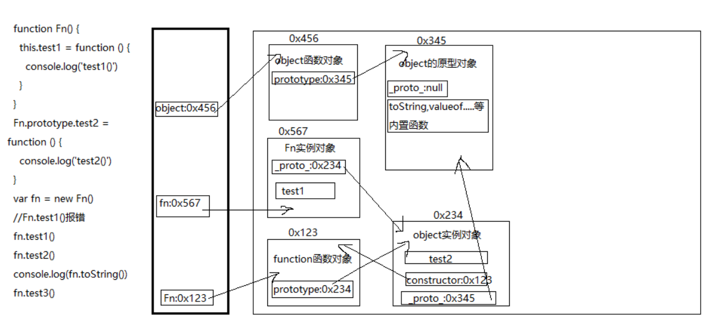
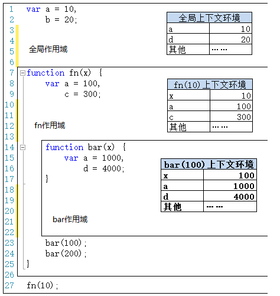

# JS高级

## 基础总结深入

### 数据类型

1. 分类(2大类)

* 基本(值)类型
  * Number: 任意数值
  * String: 任意文本
  * Boolean: true/false
  * undefined: undefined
  * null: null
  * BigInt:大整数
  * Symbol:独一无二的值
* 对象(引用)类型
  * Object: 任意对象
  * Array: 特别的对象类型(下标/内部数据有序)
  * Function: 特别的对象类型(可执行)
  * 这三个都是构造函数
  * Array和Function是Object的实例

2. 判断

* typeof:
  * 可以区别: 基本数据类型+Function
  * 不能区别: 对象(数组和null返回object)
* instanceof
  * 专门用来判断对象的具体类型
  * a instanceof b-->a是不是b的实例
* ===
  * 可以判断: undefined和null

```javascript
// typeof: 返回的是数据类型的字符串表达形式，全为小写
//1. 基本类型
var a
console.log(a, typeof a, a===undefined) // undefined 'undefined' true
console.log(a===typeof a) // false

a = 3
console.log(typeof a === 'number')//true
a = 'atguigu'
console.log(typeof a === 'string')//true
a = true
console.log(typeof a === 'boolean')//true

a = null
console.log(a===null) // true
console.log(typeof a) // 'object'

console.log('--------------------------------')

//2. 对象类型
var b1 = {
  b2: [2, 'abc', console.log],
  b3: function () {
    console.log('b3()')
  }
}
console.log(b1 instanceof Object, typeof b1) // true 'object'
console.log(b1.b2 instanceof Array, typeof b1.b2) // true 'object'
console.log(b1.b3 instanceof Function, typeof b1.b3) // true 'function'

console.log(typeof b1.b2[2]) // 'function'
console.log(b1.b2[2]('abc')) // 'abc' undefined

console.log("---------------------")
//与java中用法一样
class c1{

}
class c2 extends c1{

}
const c=new c2();
console.log(c instanceof c1);//true
```

3. 注意：

   1. undefined与null的区别?
      * undefined代表没有赋值
      * null代表赋值了, 只是值为null
   2. 什么时候给变量赋值为null呢?
      * var a = null //a将指向一个对象, 但对象此时还没有确定
      * a = null //让a指向的对象成为垃圾对象
      * 为什么typeof null=object但null本身为基本数据类型
        * 因为可以让程序员预定义变量，提高代码可读性
   3. 严格区别变量类型与数据类型?

   * js的变量本身是没有类型的, 变量的类型实际上是变量内存中数据的类型
   * 变量类型:
     * 基本类型: 保存基本类型数据的变量
     * 引用类型: 保存对象地址值的变量
   * 数据对象
     * 基本类型
     * 对象类型

### 数据&内存&变量

#### 定义

1. 什么是数据?

* 存储于内存中代表特定信息的'东东', 本质就是0101二进制
* 具有可读和可传递的基本特性
* 万物(一切)皆数据, 函数也是数据
* 程序中所有操作的目标: 数据
  * 算术运算
  * 逻辑运算
  * 赋值
  * 调用函数传参
    ...

2. 什么是内存?

* 内存条通电后产生的存储空间(临时的)
* 产生和死亡: 内存条(集成电路板)==>通电==>产生一定容量的存储空间==>存储各种数据==>断电==>内存全部消失
* 内存的空间是临时的, 而硬盘的空间是持久的
* 一块内存包含2个数据
  * 内部存储的数据(一般数据/地址数据)
  * 内存地址值数据
* 内存分类
  * 栈: 全局变量, 局部变量 (空间较小)
  * 堆: 对象 (空间较大)
* 内存：RAM+ROM

3. 什么是变量?

* 值可以变化的量, 由变量名与变量值组成
* 一个变量对应一块小内存, 变量名用来查找到内存, 变量值就是内存中保存的内容

4. 内存,数据, 变量三者之间的关系

* 内存是一个容器, 用来存储程序运行需要操作的数据
* 变量是内存的标识, 我们通过变量找到对应的内存, 进而操作(读/写)内存中的数据

#### 变量存储

问题: var a = xxx, a内存中到底保存的是什么?

* xxx是一个基本数据  a保存值
* xxx是一个对象     a保存地址
* xxx是一个变量   a保存变量的内容

#### 函数传参

问题: 在js调用函数时传递变量参数时, 是值传递还是引用传递

* 只有值传递, 没有引用传递, 传递的都是变量的值, 只是这个值可能是基本数据, 也可能是地址(引用)数据
* 如果后一种看成是引用传递, 那就值传递和引用传递都可以有

#### 内存管理

问题: JS引擎如何管理内存?

1. 内存生命周期
   - 分配需要的内存
   - 使用分配到的内存
   - 不需要时将其释放/归还
2. 释放内存
   * 为执行函数分配的栈空间内存: 函数执行完自动释放
   * 存储对象的堆空间内存: 当内存没有引用指向时, 对象成为垃圾对象, 垃圾回收器后面就会回收释放此内存

### 对象

问题: 什么时候必须使用['属性名']的方式?

* 属性名不是合法的标识名
* 属性名不确定

```javascript
/*情形一: 属性名不是合法的标识名*/
/*需求: 添加一个属性: content-type: text/json */
//  p.content-type = 'text/json' //不正确
p['content-type'] = 'text/json'

/*情形二: 属性名不确定*/
var prop = 'xxx'
var value = 123
// p.prop = value  //不正确
p[prop] = value
console.log(p['content-type'], p[prop])
```

### 函数

* 什么是函数?

  * 用来实现特定功能的, n条语句的封装体
  * 只有函数类型的数据是可以执行的, 其它的都不可以
* 为什么要用函数?

  * 提高复用性
  * 便于阅读交流
* 函数也是对象

  * instanceof Object===true
  * 函数有属性: prototype
  * 函数有方法: call()/apply()
  * 可以添加新的属性/方法
* 函数的3种不同角色

  * 一般函数 : 直接调用
  * 构造函数 : 通过new调用
  * 对象 : 通过.调用内部的属性/方法
* 函数中的this

  * 显式指定谁: obj.xxx()
  * 通过call/apply指定谁调用: xxx.call(obj)
  * 不指定谁调用: xxx()  : window
  * 回调函数: 看背后是通过谁来调用的: window/其它
* 匿名函数自调用:

  ```
  (function(w, obj){
    //实现代码
  })(window, obj)
  ```

  * 专业术语为: IIFE (Immediately Invoked Function Expression) 立即调用函数表达式
* 回调函数的理解

  * 什么函数才是回调函数?
    * 你定义的
    * 你没有调用
    * 但它最终执行了(在一定条件下或某个时刻)
  * 常用的回调函数
    * dom事件回调函数
    * 定时器回调函数
    * ajax请求回调函数
    * 生命周期回调函数

### this

```javascript
function Person(color) {
  console.log(this)
  this.color = color;
  this.getColor = function () {
    console.log(this)
    return this.color;
  };
  this.setColor = function (color) {
    console.log(this)
    this.color = color;
  };
}

Person("red"); //this是谁?
//window
var p = new Person("yello"); //this是谁?
//p
p.getColor(); //this是谁?
//p
var obj = {};
p.setColor.call(obj, "black"); //this是谁?
//obj
var test = p.setColor;
test(); //this是谁?
//window
function fun1() {
  function fun2() {
    console.log(this);
  }

  fun2(); //this是谁?
  //window
}
fun1();
```

## 函数高级

### 原型与原型链

#### 函数的原型

- 每个函数都有一个prototype属性, 它默认指向一个Object空实例对象(即称为: 原型对象)
- 原型对象中有一个属性constructor, 它指向函数对象

  
- 给原型对象添加属性(一般都是方法)

  - 作用: 构造函数的所有实例对象自动拥有原型中的属性(方法)

#### 显示原型与隐式原型

1. 每个函数function都有一个prototype，即显式原型
2. 每个实例对象都有一个__proto__，可称为隐式原型
3. 对象的隐式原型的值为其对应构造函数的显式原型的值
4. 内存结构(图)

   
5. 总结:

* 函数的prototype属性: 在定义函数时自动添加的, 默认值是一个空Object对象
* 对象的__proto__属性: 创建对象时自动添加的, 默认值为构造函数的prototype属性值
* 程序员能直接操作显式原型, 但不能直接操作隐式原型(ES6之前)

#### 原型链

1. 原型链(图解)

   

* 访问一个对象的属性时，
  * 先在自身属性中查找，找到返回
  * 如果没有, 再沿着__proto__这条链向上查找, 找到返回
  * 如果最终没找到, 返回undefined
* 别名: 隐式原型链
* 作用: 查找对象的属性(方法)

2. 构造函数/原型/对象的关系(图解)

   

   ```javascript
   var o1=new Object()
   var o2={}
   ```
3. 构造函数/原型/对象的关系2(图解)

   

   ```javascript
   function Foo(){ }
   var Foo=new Function()
   Function=new Function()
   //Object是Function的实例，Object.__proto__===Function.prototype
   //Function是Function的实例，Function.__proto__===Function.prototype
   //Function的原型是Object的实例,
   //Function.prototype.__proto__===Object.prototype
   ```

   ```javascript
   //1.函数的显示原型指向的对象默认是空object实例对象（但object函数的原型不符合)
   console.log(Foo.prototype instanceof Object);//true
   console.log(Object.prototype instanceof Object);//false
   console.log(Function.prototype instanceof Object);//true
   //2.所有函数都是Function的实例,包括它本身
   console.log(Function.__proto__=== Function.prototype);//true
   //3.object的原型对象是原型链的尽头
   console.log(Object.prototype.__proto__)//null
   ```

#### 属性

1. 读取对象的属性值时: 会自动到原型链中查找
2. 设置对象的属性值时: 不会查找原型链, 如果当前对象中没有此属性, 直接添加此属性并设置其值
3. 方法一般定义在原型中, 属性一般通过构造函数定义在对象本身上

#### instanceof

1. instanceof是如何判断的?

* 表达式: A instanceof B
* 如果B函数的显式原型对象在A对象的原型链上, 返回true, 否则返回false

2. Function是通过new自己产生的实例

```javascript
console.log(Object instanceof Function)//true
console.log(Object instanceof Object)//true
console.log(Function instanceof Object)//true
console.log(Function instanceof Function)//true
function Foo() {}
console.log(Object instanceof  Foo);//false
```

#### 测试题

```javascript
/*
测试题1
*/
var A = function() {

}
A.prototype.n = 1

var b = new A()

A.prototype = {
  n: 2,
  m: 3
}

var c = new A()
console.log(b.n, b.m, c.n, c.m)//1 undefined 2 3


/*
  测试题2
*/
var F = function(){};
Object.prototype.a = function(){
  console.log('a()')
};
Function.prototype.b = function(){
  console.log('b()')
};
var f = new F();
f.a()
//f.b()//报错
F.a()
F.b()
```

### 执行上下文与执行上下文栈

#### 变量提升与函数提升

1. 变量声明提升

* 通过var定义(声明)的变量, 在定义语句之前就可以访问到
* 值: undefined

2. 函数声明提升

* 通过function声明的函数, 在之前就可以直接调用
* 值: 函数定义(对象)

3. 问题: 变量提升和函数提升是如何产生的?

```javascript
/*
  面试题: 输出什么?
  */
var a = 4
function fn () {
  console.log(a)
  var a = 5//被提升
}
fn()//undefined


/*变量提升*/
console.log(a1) //可以访问, 但值是undefined
/*函数提升*/
a2() // 可以直接调用

var a1 = 3
function a2() {
  console.log('a2()')
}
```

#### 执行上下文

1. 代码分类(位置)

* 全局代码
* 函数代码

2. 全局执行上下文

   * 在执行全局代码前将window确定为全局执行上下文
   * 对全局数据进行预处理

     * var定义的全局变量==>undefined, 添加为window的属性
     * function声明的全局函数==>赋值(fun), 添加为window的方法
     * this==>赋值(window)
   * 开始执行全局代码

   ```javascript
   console.log(a1)//undefined
   console.log(a2)//undefined
   console.log(a3)//函数体
   // console.log(a4)//报错
   console.log(this)//window

   var a1 = 3
   var a2 = function () {
     console.log('a2()')
   }
   function a3() {
     console.log('a3()')
   }
   a4 = 4
   ```
3. 函数执行上下文

* 在调用函数, 准备执行函数体之前, 创建对应的函数执行上下文对象
* 对局部数据进行预处理

  * 形参变量==>赋值(实参)==>添加为执行上下文的属性
  * arguments==>赋值(实参列表), 添加为执行上下文的属性
  * var定义的局部变量==>undefined, 添加为执行上下文的属性
  * function声明的函数 ==>赋值(fun), 添加为执行上下文的方法
  * this==>赋值(调用函数的对象)
* 开始执行函数体代码

  ```javascript
  function fn(x, y) {
  console.log(x, y)//(undefined,undefined)
  console.log(b1)//undefined
  console.log(b2)//函数体
  console.log(arguments)//类数组
  console.log(this)//window

  // console.log(b3)//报错

  var b1 = 5
  function b2 () {

  }
  b3 = 6
  }
  fn()
  ```

#### 执行上下文栈

1. 在全局代码执行前, JS引擎就会创建一个栈来存储管理所有的执行上下文对象
2. 在全局执行上下文(window)确定后, 将其添加到栈中(压栈)
3. 在函数执行上下文创建后, 将其添加到栈中(压栈)
4. 在当前函数执行完后,将栈顶的对象移除(出栈)
5. 当所有的代码执行完后, 栈中只剩下window

##### 理解

```javascript
var a = 10;
var bar = function (x) {
   var b = 5;
   foo(x + b);
}
var foo = function (y) {
   var c = 5;
   console.log(a + c + y);
}
bar(10);
bar(10);  //30

```

- 在刚刚的引例中(两个bar(10))，产生了5个函数上下文执行对象（调用时产生），四次调用，一次window。
- 产生的上下文：调用函数的次数加上全局执行上下文

#### 测试题

```javascript
/*
测试题1: 说明：函数提升优先级高于变量提升，且不会被同名变量声明时覆盖，但是会被同名变量赋值后覆盖。
*/
function a() {}
var a;
console.log(typeof a)//function
```

```javascript
/*
测试题2: 变量预处理, in操作符
  */
if (!(b in window)) {//b in window===true
  var b = 1;//var变量没有块作用域,被提升
}
//console.log(window)
console.log(b)//undefined
```

```javascript
/*
测试题3: 被同名变量覆盖报错
  */
var c = 1
function c(c) {
  console.log(c)
  var c = 3
}
//c(2) 报错
```

### 作用域

#### 定义

1. 理解

* 就是一块"地盘", 一个代码段所在的区域
* 它是静态的(相对于上下文对象), 在编写代码时就确定了

2. 分类

* 全局作用域
* 函数作用域
* 没有块作用域(ES6有了)

3. 作用

* 隔离变量，不同作用域下同名变量不会有冲突

#### 与执行上下文

作用域先于执行上下文

1. 区别1

* 全局作用域之外，每个函数都会创建自己的作用域，作用域在函数定义时就已经确定了。而不是在函数调用时
* 全局执行上下文环境是在全局作用域确定之后, js代码马上执行之前创建
* 函数执行上下文环境是在调用函数时, 函数体代码执行之前创建

2. 区别2

* 作用域是静态的, 只要函数定义好了就一直存在, 且不会再变化
* 上下文环境是动态的, 调用函数时创建, 函数调用结束时上下文环境就会被释放

3. 联系

* 上下文环境(对象)是从属于所在的作用域
* 全局上下文环境==>全局作用域
* 函数上下文环境==>对应的函数作用域




#### 作用域链

- 理解
  * 多个上下级关系的作用域形成的链, 它的方向是从下向上的(从内到外)
  * 查找变量时就是沿着作用域链来查找的
- 查找一个变量的查找规则：
  ```
  1. 在当前作用域下的执行上下文中查找对应的属性, 如果有直接返回, 否则进入2
  2. 在上一级作用域的执行上下文中查找对应的属性, 如果有直接返回, 否则进入3
  3. 再次执行2的相同操作, 直到全局作用域, 如果还找不到就抛出找不到的异常
  ```

#### 测试题

```javascript
/*
  问题: 结果输出多少?
*/
var x = 10;
function fn() {
  console.log(x);
}
function show(f) {
  var x = 20;
  f();//10
}
show(fn);
```

```javascript
/*
  说说它们的输出情况
*/
var fn = function () {
  console.log(fn)
}
fn()//函数体

var obj = {
  fn2: function () {
    console.log(fn2)//this.fn2则不报错
  }
}
obj.fn2()//报错
```

### 闭包

#### 理解闭包

1. 如何产生闭包?

* 当一个嵌套的内部(子)函数引用了嵌套的外部(父)函数的变量(函数)时, 就产生了闭包

2. 闭包到底是什么?

* 使用chrome调试查看
* 理解一: 闭包是嵌套的内部函数(绝大部分人)
* 理解二: 包含被引用变量(函数)的对象(极少数人)
* 注意: 闭包存在于嵌套的内部函数中

3. 产生闭包的条件?

* 函数嵌套
* 内部函数引用了外部函数的数据(变量/函数)
  ```html
  <script type="text/javascript">
    function fn1 () {
      var a = 3
      function fn2 () {//执行函数定义就会产生闭包(不用调用内部函数)
        console.log(a)
      }
      fn2()
    }
    fn1()
    //fn2中的closure对象是闭包
  </script>
  ```

#### 常见的闭包

```javascript
// 1. 将函数作为另一个函数的返回值
function fn1() {
  var a = 2

  function fn2() {
    a++
    console.log(a)
  }

  return fn2
}
var f = fn1()//外部函数执行，产生一个闭包
f() // 3
f() // 4

// 2. 将函数作为实参传递给另一个函数调用
function showMsgDelay(msg, time) {
  setTimeout(function () {
    console.log(msg)
  }, time)
}
showMsgDelay('hello', 1000)
```
#### 闭包的作用
1. 使用函数内部的变量在函数执行完后, 仍然存活在内存中(延长了局部变量的生命周期)
2. 让函数外部可以操作(读写)到函数内部的数据(变量/函数)
（外部只能做闭包里对变量的操作，没法对变量做其他操作）

问题:
  1. 函数执行完后, 函数内部声明的局部变量是否还存在?一般不存在，存在于闭包内的变量才可能存在
  2. 在函数外部能直接访问函数内部的局部变量吗?不能，但我们能够使用闭包操作内部数据
```javascript
function fun1() {
  var a = 3;

  function fun2() {
    a++;            //引用外部函数的变量--->产生闭包
    console.log(a);
  }

  return fun2;
}
var f = fun1();  //由于f引用着内部的函数-->内部函数以及闭包都没有成为垃圾对象
f();   //间接操作了函数内部的局部变量
f();
```
#### 闭包的生命周期
1. 产生: 在嵌套内部函数定义执行完时就产生了(不是在调用)
2. 死亡: 在嵌套的内部函数成为垃圾对象时
```javascript
function fun1() {
  //此处闭包已经产生
  var a = 3;

  function fun2() {
    a++;
    console.log(a);
  }

  return fun2;
}
var f = fun1();

f();
f();
f = null //此时闭包对象死亡
```
#### 使用闭包实现自定义模块
- 定义模块1
  ```javascript
  function coolModule() {
    //私有的数据
    var msg = 'atguigu'
    var names = ['I', 'Love', 'you']

    //私有的操作数据的函数
    function doSomething() {
      console.log(msg.toUpperCase())
    }
    function doOtherthing() {
      console.log(names.join(' '))
    }

    //向外暴露包含多个方法的对象
    return {
      doSomething: doSomething,
      doOtherthing: doOtherthing
    }
  }
  ```
- 引用模块1
  ```html
  <script type="text/javascript" src="05_coolModule.js"></script>
  <script type="text/javascript">
  var module = coolModule()
  module.doSomething()
  module.doOtherthing()
  </script>
  ```
- 定义模块2
  ```javascript
  //优点--不用再调用函数
  (function (window) {
    //私有的数据
    var msg = 'atguigu'
    var names = ['I', 'Love', 'you']
    //操作数据的函数
    function a() {
      console.log(msg.toUpperCase())
    }
    function b() {
      console.log(names.join(' '))
    }

    window.coolModule2 =  {
      doSomething: a,
      doOtherthing: b
    }
  })(window)
  ```
- 引用模块2
  ```html
  <script type="text/javascript" src="05_coolModule2.js"></script>
  <script type="text/javascript">
  coolModule2.doSomething()
  coolModule2.doOtherthing()
  </script>
  ```
#### 闭包的缺点以及解决方法
1. 缺点
  * 函数执行完后, 函数内的局部变量没有释放, 占用内存时间会变长
  * 容易造成内存泄露(这块内存被占用着，且不被使用)
2. 解决
  * 能不用闭包就不用
  * 及时释放

#### 测试题
参考文档面试题21