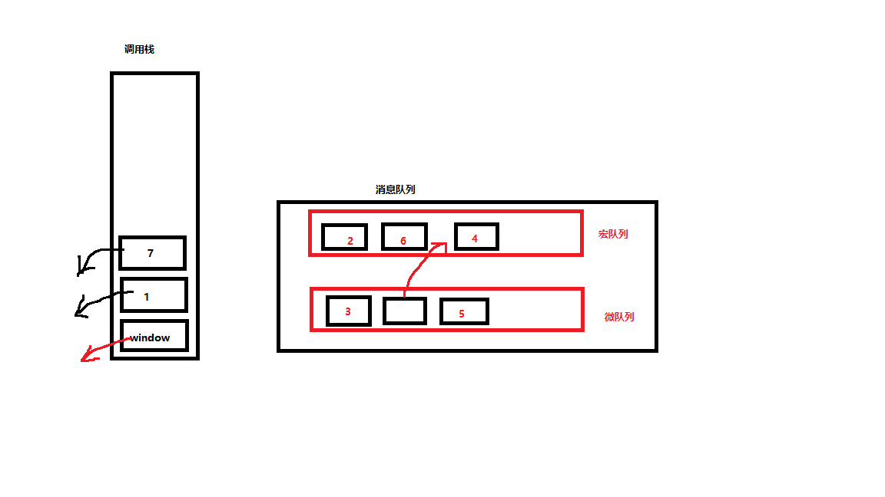

# node.js笔记

## 引入

### 安装

参考链接：[node.js的安装](https://www.lilichao.com/index.php/2022/10/08/node-js%e7%ae%80%e4%bb%8b%e5%ae%89%e8%a3%85/)

官网：[node.js官网](https://nodejs.dev/en/)

### 作用

Node.js是一个构建在V8引擎之上的JavaScript运行环境。它使得JS可以运行在浏览器以外的地方。相对于大部分的服务端语言来说，Node.js有很大的不同，它采用了单线程，且通过异步的方式来处理并发的问题。

### 同步与异步

* 什么是同步
  - 通常情况代码都是自上向下一行一行执行的
  - 前边的代码不执行后边的代码也不会执行
  - 同步的代码执行会出现阻塞的情况
  - 一行代码执行慢会影响到整个程序的执行

- 解决同步问题：

  - java python
    - 通过多线程来解决
  - node.js
    - 通过异步方式来解决
- 什么是异步

  - 一段代码的执行不会影响到其他的程序
  - 异步的问题：

    - 异步的代码无法通过return来设置返回值
  - 特点：

    - 不会阻塞其他代码的执行
    - 需要通过回调函数来返回结果
  - 基于回调函数的异步带来的问题:

    - 代码的可读性差

    * 可调试性差
- 解决异步问题：

  - 需要一个东西，可以代替回调函数来给我们返回结果

## Promise

### 为什么需要promise?

问题：
异步必须通过回调函数来返回结果，回调函数一多会出现"回调地狱"

Promise

- Promise 可以帮助我们解决异步中的回调函数的问题
- Promise 就是一个用来存储数据的容器

它拥有着一套特殊的存取数据的方式，这个方式使得它里边可以存储异步调用的结果

```
在调试控制台中输出对象，[[]]表示这个属性是私有属性，无法访问
```

### 创建对象

- 创建 Promise 时，构造函数中需要一个函数作为参数
- Promise 构造函数的回调函数，它会在创建 Promise 时调用，调用时会有两个参数传递	进去
- resolve 和 reject 是两个函数，通过这两个函数可以向 Promise 中存储数据

  - resolve 在执行正常时存储数据
  - reject 在执行错误时存储数据
- 通过函数来向 Promise 中添加数据，好处就是可以用来添加异步调用的数据

  ```javascript
  const promise=new Promise((resolve,reject)=>{
      resolve("通过resolve存储数据")
      //reject("通过reject存储数据")
  })
  console.log(promise)
  // 大概的底层的实现
  /*class Promise{
      function resolve(data){
          this.#PromiseResult=data
      } 
      function reject(data){
          this.#PromiseResult=data
      }
      constructor(cb){
          cb(resolve,reject)
      }
  }*/
  ```

### 私有属性

- PromiseResult- 用来存储数据
- PromiseState- 记录Promise的状态

### 实例方法

* then

  * 可以通过 Promise 的实例方法 then 来读取 Promise 中存储的数据
  * then 需要两个回调函数作为参数，回调函数用来获取 Promise 中的数据
  * 通过 resolve 存储的数据，会调用第一个函数返回，可以在第一个函数中编写处理数据的代码
  * 通过 reject 存储的数据或者出现异常时，会调用第二个函数返回,可以在第二个函数中编写处理异常的代码

  ```javascript
  const promise=new Promise((resolve,reject)=>{
    resolve("通过resolve存储数据")
    //reject("通过reject存储数据")
  })
  promise.then((result)=>{
    console.log(1,result)
  },(reason)=>{
    console.log(2,reason)
  })
  //大概的底层实现
  /*class Promise{
    then(f1,f2){
        if(this.#PromiseState===fulfilled){
            f1(this.#PromiseResult)
        }else if(this.#PromiseState===reject){
            f2(this.#PromiseResult)
        }
    }
  }*/
  ```

- cache

  - catch() 用法和 then 类似，但是只需要一个回调函数作为参数
  - catch()中的回调函数只会在 Promise 被拒绝时才调用
  - catch() 相当于 then(null, reason => {})
  - catch() 就是一个专门处理 Promise 异常的方法
  - 当Promise出现异常时，而整个调用链中没有出现catch，则异常会向外抛出(调用链前面的异常会抛给后面的处理，所以我们一般把catch放到最后)
- finally

  - 无论是正常存储数据还是出现异常了，finally 总会执行
  - 但是 finally 的回调函数中不会接收到数据
  - finally()通常用来编写一些无论成功与否都要执行代码

### 原理

- 当 Promise 创建时，PromiseState初始值为 pending
- 当通过resolve存储数据时， PromiseState 变为fulfilled（完成）
  PromiseResult变为存储的数据
- 当通过reject存储数据或出错时 PromiseState 变为rejected（拒绝，出错了）
  PromiseResult变为存储的数据 或 异常对象
- 当我们通过then读取数据时，相当于为Promise设置了回调函数
- 如果PromiseState变为fulfilled，则调用then的第一个回调函数来返回数据
- 如果PromiseState变为rejected，则调用then的第二个回调函数来返回数据

### 链式调用

```
promise中的
	then (return new Promise())
	catch
	finally
		- finally的返回值，不会存储到新的Promise中

这三个方法都会返回一个新的Promise,Promise中会存储回调函数的返回值

后边的方法（then和catch）读取的上一步的执行结果
如果上一步的执行结果不是当前想要的结果，则跳过当前的方法
```

```javascript
  const p = new Promise((resolve, reject) => {
    resolve("数据1")
  })
  const p1 = p.then((result) => {
    console.log(result)
    return "数据2"
  }, null)

  const p2 = p1.then((result) => {
    console.log(result)
  }, null)

  p2.then((result) => {
    console.log(result)
  })
  /*
  数据1
  数据2
  undefined*/

```

### 静态方法

- 创建即时对象

  - Promise.resolve() 创建一个立即完成的Promise
  - Promise.reject() 创建一个立即拒绝的Promise

  ```javascript
  const p = Promise.resolve(10)//相当于创建对象
  console.log(p)
  //等价于
  // new Promise((resolve, reject) => {
  //     resolve(10)
  // })
  ```
- all

  - Promise.all([...]) 同时返回多个Promise的执行结果（执行结果的数组）其中有一个报错，就返回错误
  - Promise.allSettled([...]) 同时返回多个Promise的执行结果(无论成功或失败)
    成功：{status: 'fulfilled', value: 579}
    失败：{status: 'rejected', reason: '哈哈'}

  ```javascript
  Promise.all([
      sum(123, 123),
      sum(2, 555),
      sum(43, 56)
  ]).then(r => {
      console.log(r)
  })//[246, 557, 99]
  ```

  ```javascript
  Promise.allSettled([
      sum(123, 123),
      sum(2, 555),
      Promise.reject("哈哈"),
      sum(43, 56)
  ]).then(r => {
      console.log(r)
  })
  ```
- 最快

  - Promise.race([...]) 返回执行最快的Promise（不考虑对错）
  - Promise.any([...]) 返回执行最快的完成的Promise（考虑对错）
    - 如果any的参数数组中全为拒绝的Promise对象，则只能报错

  ```javascript
  Promise.race([
      Promise.reject(1111),
      sum(123, 456),
      sum(5, 6),
      sum(33, 44)
  ]).then(r => {
      console.log(r)
  }).catch(r => {
      console.log("错误")
  })//错误
  ```

  ```javascript
  Promise.any([
      Promise.reject(1111),
      sum(123, 456),
      sum(5, 6),
      sum(33, 44)
  ]).then(r => {
      console.log(r)
  }).catch(r => {
      console.log("错误")
  })//579
  ```

### 事件机制

- JS是单线程的，它的运行时基于事件循环机制（event loop）

  - 调用栈放的是要执行的代码
  - 任务队列的是将要执行的代码
  - 当调用栈中的代码执行完毕后，队列中的代码才会按照顺序依次进入到栈中执行
  - 在JS中任务队列有两种
    - 宏任务队列 （大部分代码都去宏任务队列中去排队）[定时器,dom绑定事件，ajax]
    - 微任务队列 （Promise的回调函数（then、catch、finally））
  - 整个流程
    ① 执行调用栈中的代码
    ② 执行微任务队列中的所有任务
    ③ 执行宏任务队列中的所有任务
- Promise的执行原理

  - Promise在执行，then就相当于给Promise绑定了回调函数
  - 当Promise的状态从pending 变为 fulfilled/rejected时，then的回调函数会被放入到任务队列中

补充

```
queueMicrotask(回调函数) 用来向微任务队列中添加一个任务
```

```javascript
console.log(1);

setTimeout(() => console.log(2));

Promise.resolve().then(() => console.log(3));

Promise.resolve().then(() => setTimeout(() => console.log(4)));
//当它执行时才会把4放进宏任务队列

Promise.resolve().then(() => console.log(5));

setTimeout(() => console.log(6));

console.log(7);
//1735264
```



### async与await

- 通过async可以来创建一个异步函数

  - 异步函数的返回值会自动封装到一个Promise中返回

    ```javascript
    async function fn() {
        return 10;
    }
    let result = fn()
    console.log(result)//Promise对象
    result.then((result) => {
        console.log(result)//10
    })
    /*等价于：
    function fn(){
        return new Promise((reslove,reject)=>{
            reslove(10)
        })
    }*/
    ```
- await

  - Promise解决了异步调用中回调函数问题，虽然通过链式调用解决了回调地狱，但是链式调用太多以后还是不好看
  - 我们更希望以同步的方式去调用异步的代码
  - 当我们通过await去调用异步函数时，它会暂停代码的运行
    直到异步代码执行有结果(PromiseResult有值)时，才会将结果(PromiseResult)返回
  - 注意 :
    - await只能用于 async声明的异步函数中，或es模块的顶级作用域中
    - await阻塞的只是异步函数内部的代码，不会影响外部代码
    - 通过await调用异步代码时，需要通过try-catch来处理异常
    - 当我们使用await调用函数后，当前函数后边的所有代码会在当前函数执行完毕后，被放入到微任务队里中【注意是执行完毕后，这也是await实现代码异步的关键】

      ```javascript
      async function fn4() {
          console.log(1)
          await console.log(2)
          await console.log(3)
          console.log(4)
      }
      //等价于：
      function fn5() {
          return new Promise(resolve => {
              console.log(1)
              // 加了await
              console.log(2)
              resolve()
          }).then(r => {
              console.log(3)
          }).then(r=>{
              console.log(4)
          })
      }
      fn5()
      console.log(5)//12534
      ```
  - 使用场景
    - async函数内
    - .mjs文件内
    - 网页里script<type="module">内部直接使用

## 模块化

- 为什么要引入模块化
  - 早期的网页中，是没有一个实质的模块规范的
    我们实现模块化的方式，就是最原始的通过script标签来引入多个js文件
    (相当于把js文件里的代码都拼凑一起，不具备封装性)
    问题：
    - 无法选择要引入模块的哪些内容
    - 在复杂的模块场景下非常容易出错(模块互相依赖)......
      于是，我们就继续在js中引入一个模块化的解决方案

### CommonJS

```
在node中，默认支持的模块化规范叫做CommonJS。

默认情况下，Node.js会将以下内容视为CommonJS模块：

1-使用.cjs为扩展名的文件

2-当前package.json的type属性为commonjs时,扩展名为.js的文件

3-当前的package.json不包含type属性时，扩展名为.js的文件
4-文件的扩展名是mjs、cjs、json、node、js以外的值时（type不是module时）
```

### CommonJS-使用规范

#### 引入模块

* 使用require("模块的路径")函数来引入模块

---

* 引入自定义模块时：

- 模块的路径名要以./ 或 ../开头
- 扩展名可以省略
  在CommonJS中，如果省略的js文件的扩展名,node会自动为文件补全扩展名`js --> json --> node（特殊）`
  [cjs为扩展名，表示是一个CommonJS标准的模块]

---

* 引入核心模块时：

- 直接写核心模块的名字即可
- 也可以在核心模块前添加 “node:”

---

* 引入文件夹模块

  当我们使用一个文件夹作为模块时，文件夹中必须有一个模块的主文件。如果文件夹中含有package.json文件且文件中设置main属性，则main属性指定的文件会成为主文件，导入模块时就是导入该文件。如果没有package.json，则node会按照index.js、index.node的顺序寻找主文件

#### 使用模块

- 在定义模块时，模块中的内容默认是不能被外部看到的
- 可以通过exports来设置要向外部暴露的内容

  - 访问exports的方式有两种：
    - exports
    - module.exports
    - (exports===module.exports)
- 当我们在其他模块中引入当前模块时，require函数返回的就是exports
- 可以将希望暴露给外部模块的内容设置为exports的属性

  ```javascript
  // 可以通过exports 一个一个的导出值
  // exports.a = "孙悟空"
  // exports.b = {name:"白骨精"}
  // exports.c = function fn(){
  //     console.log("哈哈")
  // }

  // 也可以直接通过module.exports同时导出多个值
  module.exports = {
      a: "哈哈",
      b: [1, 3, 5, 7],
      c: () =>{
          console.log(111)
      }
  }
  ```

  思考：为什么不能exports={}来同时导出多个值?

  ```javascript
  //通过解构赋值接收模块结果
  const {name, age, gender} = require("./m3")

  console.log(name, age, gender)
  ```

### CommonJS-原理

- 所有的CommonJS的模块都会被包装到一个函数中

```javascript
(function(exports, require, module, __filename, __dirname) {
    // 模块代码会被放到这里
 });
```

- __filename表示当前模块的绝对路径
- __dirname当模块所在目录的绝对路径
- 一个模块就是一个闭包，引用模块就把闭包执行一次

### ES模块化

```
默认情况下，node中的模块化标准是CommonJS
要想使用ES的模块化，可以采用以下两种方案:

1.使用mjs作为扩展名【可以直接使用await】

2.修改package.json将模块化规范设置为ES模块
当我们设置 "type": "module" 当前项目下所有的js文件都默认为es module
```

### ES-使用规范

#### 注意点

1. 导入es模块路径需写完整("./","/"或"../"...)，不能省略扩展名（官方标准）
2. 在模块里默认导出的语法：export default 值
3. 通过ES模块化，导入的内容都是常量
4. es模块都是运行在严格模式下的
5. es模块化，在浏览器中同样支持，但是通常我们不会直接使用,通常都会结合打包工具使用

- export导出的方式有两种：

  - 默认导出
  - 命名导出

  ```javascript
  // 导出变量（命名导出）
  export let name1, name2, …, nameN; 
  export let name1 = …, name2 = …, …, nameN; 

  // 导出函数（命名导出）
  export function functionName(){...}

  // 导出类（命名导出）
  export class ClassName {...}

  // 导出一组
  export { name1, name2, …, nameN };

  // 重命名导出
  export { variable1 as name1, variable2 as name2, …, nameN };

  // 解构赋值后导出
  export const { name1, name2: bar } = o;

  // 默认导出
  export default expression;
  export default function (…) { … } // also class, function*
  export default function name1(…) { … } // also class, function*
  export { name1 as default, … };

  // 聚合模块
  export * from …; // 将其他模块中的全部内容导出（除了default）
  export * as name1 from …; //将其他模块中的全部内容以指定别名导出
  export { name1, name2, …, nameN } from …; // 将其他模块中的指定内容导出
  export { import1 as name1, import2 as name2, …, nameN } from …; // 将其他模块中的指定内容重命名导出
  ```
- import导入

  ```javascript
  //使用解构赋值
  import { a, b, c } from "./m4.mjs"

  // 通过as来指定别名
  import { a as hello, b, c } from "./m4.mjs"

  //开发中不推荐使用这种方式引包，不利于后面项目的打包上线
  import * as m4 from "./m4.mjs"

  // 默认导出
  // 1.无须用{}栝起
  // 2.默认导出的内容，可以随意命名
  import sum from "./m4.mjs"
  ```

### node.js核心模块

- 核心模块，是node中自带的模块，可以在node中直接使用
- window 是浏览器的宿主对象 node中是没有的
- global 是node中的全局对象，作用类似于window
- ES标准下，全局对象的标准名应该是 globalThis
  - 浏览器的globalThis==window
  - node的globalThis==global
  - globalThis表示通用的全局变量，在不同环境globalThis值不同

#### process

- 表示当前的node进程
- 通过该对象可以获取进程的信息，或者对进程做各种操作
- 如何使用:
  - process是一个全局变量，可以直接使用
  - 有哪些属性和方法：
    - process.exit()
      - 结束当前进程，终止node
      - 参数：数字表示状态码,用于区分结束原因
    - process.nextTick(回调函数)
      - 将函数插入到 tick队列中
      - 调用栈->tick队列->微任务队列->宏任务队列

#### path

- 表示的路径
- 通过path可以用来获取各种路径
- 要使用path，需要先对其进行引入

  ```javascript
  const path=require("node:path"）
  const result = path.resolve(__dirname, "./hello.js")
  ```

#### fs （File System）

- fs用来帮助node来操作磁盘中的文件
- 文件操作也就是所谓的I/O，input output
- 使用fs模块，同样需要引入

---

- fs.readFile() 读取文件

  ```javascript
  const fs = require("node:fs")
  const path = require("node:path")
  //同步写法
  const buf = fs.readFileSync(path.resolve(__dirname, "./t.txt"))
  console.log(buf.toString())
  //异步写法，会回调地狱
  fs.readFile(path.resolve(__dirname, "./t.txt"),
      (err, buffer) => {
          if (err) {
              console.log("出错了");
          } else {
              console.log(buffer.toString())
          }
      }
  )
  //异步函数写法
      ; (async () => {
          try {
              const buffer = await fs.readFile(path.resolve(__dirnamem, "./t.txt"))
              console.log(buffer.toString())
          } catch (e) {
              console.log("出错了")
          }
      })()
  //promise写法
  const fs2 = require("node:fs/promises")
  fs2.readFile(path.resolve(__dirname, "./t.txt")).then((buffer) => {
      console.log(buffer.toString())
  }).catch((e => {
      console.log("出错了")
  }))

  ```
- fs.appendFile() 创建新文件，或将数据添加到已有文件中

  ```javascript
  const path=require("node:path")
  const fs=require("node:fs/promises")
  //复制文件
  fs.readFile(path.resolve("F:\\FrontEnd\\node.js\\所有\\03_核心模块\\haha.jpg")).then((buf)=>{
      return fs.appendFile(path.resolve(__dirname,"./beauty.jpg"),buf)
  }).then(()=>{
      console.log("复制成功")
  })

  ```
- fs.mkdir() 创建目录
- fs.rmdir() 删除目录

  - mkdir可以接收一个 配置对象作为第二个参数，通过该对象可以对方法的功能进行配置
  - recursive 默认值为false，设置true以后，会自动创建不存在的上一级目录
  - rmkdir也有，改为true则可以直接删除有子目录的目录，但是这个配置对象已经过时

  ```javascript
  const path = require("node:path")
  const fs = require("node:fs/promises")
  fs.mkdir(path.resolve(__dirname, "./hello/abc"), { recursive: true })
      .then(() => {
          console.log("新建目录成功")
      }).catch((e) => {
          console.log("创建失败")
      })
  fs.rmdir(path.resolve(__dirname, "./hello"),{recursive:true})
      .then(() => {
          console.log("删除成功")
      })
      .catch((e) => {
          console.log("删除成功")
      })
  ```
- fs.rm() 删除文件
- fs.rename() 重命名(剪切)
- fs.copyFile() 复制文件(复制)

  ```javascript
  const fs = require("node:fs/promises")
  const path = require("node:path")
  fs.rename(path.resolve(__dirname,"./n.txt"),path.resolve(__dirname,"./nn.txt"))
  .then(()=>{
      console.log("重命名成功")
  })
  .catch((e)=>{
      console.log("重命名失败")
  })
  fs.copyFile(path.resolve(__dirname,"./beauty.jpg"),path.resolve(__dirname,"girl.jpg"))
  .then(()=>{
      console.log("复制成功")
  })
  .catch((e)=>{
      console.log("复制失败")
  })
  ```
- fs.writeFile()写文件

  ```javascript
  const path=require("path")
  const fs=require("fs/promises")
  let str="hello world"
  fs.writeFile(path.resolve(__dirname,"./nn.txt"),str)
  .then(()=>{
      console.log("写入成功")
  })
  .catch((e)=>{
      console.log("写入失败",e)
  })
  ```

## 包管理器

[ 参考博客](https://www.lilichao.com/index.php/2022/10/21/%e5%8c%85%e7%ae%a1%e7%90%86%e5%99%a8/)

### 为什么需要包管理器

```
随着项目复杂度的提升，在开发中不可能所有的代码都要手动一行一行的编写，于是我们就需要一些将一些现成写好的代

码引入到我们的项目中来帮助我们完成开发，就像是我们之前使用jQuery。

jQuery这种外部代码在项目中，我们将其称之为包。

越是复杂的项目，其中需要引入的包也就越多。随着包数量的增多，包管理的问题也被抬上了桌面。

如何下载包？如何删除包？如何更新包？等等一些列的问题在等待我们处理。包管理器便是帮助我们解决这个问题的工具。
```

### NPM

```
node中的包管理局叫做npm（node package manage），npm是世界上最大的包管理库。
```

#### 命令行

- npm init 初始化项目，创建package.json文件（需要回答问题）
- npm init -y 初始化项目，创建package.json文件（所有值都采用默认值）
- npm install 包名 将指定包下载到当前项目中
  - install时发生了什么？
    - 将包下载当前项目的node_modules目录下
    - 会在package.json的dependencies属性中添加一个新属性"包名": "版本号"
    - 会自动添加 package-lock.json文件帮助加速npm下载
- npm install 自动安装所有依赖
- npm install 包名 -g 全局安装
  - 全局安装是将包安装到计算机中
  - 全局安装的通常都是一些工具
- npm uninstall 包名 卸载

> 引入从npm下载的包时，不需要书写路径，直接写包名即可

#### package.json

- package.json是包的描述文件
- node中通过该文件对项目进行描述
- 每一个node项目必须有package.json
- name（必备）

  - 包的名称，可以包含小写字母、_和-
- version（必备）

  - 包的版本，需要遵从x.x.x的格式
  - 规则：
    - 版本从1.0.0开始
    - 修复错误，兼容旧版（补丁）1.0.1、1.0.2
    - 添加功能，兼容旧版（小更新）1.1.0
    - 更新功能，影响兼容（大更新）2.0.0
- scripts

  - 可以自定义一些命令
  - 对于自定义的属性，需用npm run 属性名调用
  - 例如

    `"build":"npx webpack"`

    `npm run build`

## http协议

[计算机网络知识](https://blog.csdn.net/ChaseAug/article/details/119111174?ops_request_misc=%257B%2522request%255Fid%2522%253A%2522164830050116782089388509%2522%252C%2522scm%2522%253A%252220140713.130102334.pc%255Fall.%2522%257D&request_id=164830050116782089388509&biz_id=0&utm_medium=distribute.pc_search_result.none-task-blog-2~all~first_rank_ecpm_v1~rank_v31_ecpm-3-119111174.142^v5^pc_search_result_cache,143^v6^register&utm_term=%E6%B9%96%E7%A7%91%E5%A4%A7%E8%AE%A1%E7%AE%97%E6%9C%BA%E7%BD%91%E7%BB%9C%E7%AC%94%E8%AE%B0&spm=1018.2226.3001.4187)

### 引入

#### 网址

- https://lilichao.com/hello/index.html
  - https:// 协议名  http ftp ...
  - lilichao.com 域名  (domain)
    - 整个网络中存在着无数个服务器，每一个服务器都有它自己的唯一标识
    - 这个标识被称为 ip地址 "192.168.1.17"，但是ip地址不方便记忆
    - 域名就相当于是ip地址的别名
  - /hello/index.html  网站资源路径

#### 面试题

- 当在浏览器中输入地址以后发生了什么？
  `https://lilichao.com/hello/index.html`

  - DNS解析，获取网站的ip地址
  - 浏览器需要和服务器建立连接（tcp/ip）（三次握手）
  - 向服务器发送请求（http协议）
  - 服务器处理请求，并返回响应（http协议）
  - 浏览器将响应的数据渲染
  - 断开和服务器的连接（四次挥手）
- 请求和响应实际上就是一段数据，只是这段数据需要遵循一个特殊的格式，
  这个特殊的格式由HTTP协议来规定

##### DNS域名解析

- 域名结构：四级域名.三级域名.二级域名.顶级域名
- 域名解析的过程：
  - 主机向本地域名服务器发送域名解析请求
  - 当本地域名服务器收到请求后，就先查询本地的缓存，如果有该记录项，则返回，无则把请求发给根域名服务器，然后根域名服务器返回给本地域名服务器顶级域名服务器地址
  - 本地域名服务器向顶级域名服务器发送请求，查询服务器缓存，有则返回，无则返回下一级服务器地址
  - 重复上一个操作，直到找到正确步骤
  - 本地域名服务器将结果保存到缓存，同时返回给主机

##### 建立TCP连接

- 客户机向服务器发送TCP连接请求，进入同步已发送状态
- 服务器收到请求后，向客户机发送连接请求的确定，进入同步已接收状态
- 客户机收到确定，向服务器发送连接请求的确定的确定，进入连接已建立状态
- 服务器收到信号，也进入连接已建立状态

##### 断开TCP连接

断开连接可能由服务器主动断开，也可以由客户端主动断开

以客户端为例：

- 客户端发送TCP连接释放报文，进入终止等待1状态
- 服务器接收信号，进入关闭等待状态。发送确定报文，客户端进入终止等待2状态

  - 此时TCP连接处于半关闭状态，服务器能够发送数据，客户端接收但不能发送
- 服务器数据传输完毕，发送连接释放报文，进入最后确认状态
- 客户端收到信号，发送确定报文后进入等待状态
- 服务器收到信号，进入关闭状态
- 客户端等待一段时间后进入关闭状态

##### TCP/IP协议族

- TCP/IP协议族中包含了一组协议
  这组协议规定了互联网中所有的通信的细节
- 网络通信的过程由四层组成
  - 应用层
    - 软件的层面，浏览器 服务器都属于应用层
    - HTTP，FTP，DNS
  - 传输层
    - 负责对数据进行拆分，把大数据拆分为一个一个小包
    - UDP，TCP
  - 网际层
    - 负责给数据包，添加信息
    - IP
  - 网络接口层
    - 传输信息
    - Ethernet，ATM，Frame Relay

### 内容

- HTTP协议就是应用层的协议，用来规定客户端和服务器间通信的报文格式
- 报文（message）
  - 浏览器和服务器之间通信是基于请求和响应的
  - 浏览器向服务器发送请求（request）
  - 服务器向浏览器返回响应（response）
- HTTP协议就是对这个报文的格式进行规定

#### 请求报文

- 客户端发送给服务器的报文称为请求报文
- 请求报文的格式如下：

**请求首行**

- 请求报文的第一行
- ` GET /index.html?username=sunwukong HTTP/1.1`

---

- `Get`表示请求的方式

  - 现在常用的方式就是get和post请求
  - get请求主要用来向服务器请求资源
  - post请求主要用来向服务器发送数据

---

- `/index.html?username=sunwukong`表示请求资源的路径

  - ? 后边的内容叫做查询字符串
  - 查询字符串是一个名值对结构，一个名字对应一个值，使用=连接，多个键值对之间使用&分割
  - `username=admin&password=123123`
  - get请求通过查询字符串将数据发送给服务器

    ```
    由于查询字符串会在浏览器地址栏中直接显示。所以,它安全性较差。
    (浏览器会把发送的数据缓存下来，作为历史记录)

    同时，由于url地址长度有限制，所以get请求无法发送较大的数据
    ```
  - post请求通过请求体来发送数据

    ```
    在chrome中通过载荷可以查看，post请求通过请求体发送数据，无法在地址栏直接查看所以安全性较好

    请求体的大小没有限制，可以发送任意大小的数据如果你需要向服务器发送数据，能用post尽量使用post请求头空行请求体
    ```

---

- HTTP/1.1 协议的版本

**请求头**

- 请求头也是名值对结构，用来告诉服务器我们浏览器的信息
- 每一个请求头都有它的作用：
  - Accept 浏览器可以接受的文件类型
  - Accept-Encoding 浏览器允许的压缩的编码
  - User-Agent 用户代理，它是一段用来描述浏览器信息的字符串

**空行**：用来分隔请求头和请求体

**请求体** ：post请求通过请求体来发送数据

---

#### 响应报文

- 服务器发给客户端的报文称为响应报文
- 响应报文的格式如下:
  - 响应首行

    - `HTTP/1.1 200 OK`
      - 200 响应状态码
      - ok 对响应状态码的描述
    - 响应状态码的规则
      - 1xx 请求处理中
      - 2xx 表示成功
      - 3xx 表示请求的重定向(网址变了)
      - 4xx 表示客户端错误
      - 5xx 表示服务器的错误
  - 响应头

    - 响应头也是一个一个的名值对结构，用来告诉浏览器响应的信息
    - Content-Type 用来描述响应体的类型
    - Content-Length 用来描述响应体大小
    - Content-Type: text/html; charset=UTF-8
    - Content-Length: 2017
  - 空行：用来分隔响应头和响应体
  - 响应体：就是服务器返回给客户端的内容(在开发者工具中网络-响应查看)

## express

- express 是node中的服务器软件

  - 通过express可以快速的在node中搭建一个web服务器
- 使用步骤：

  1. 创建并初始化项目`npm init -y`
  2. 安装express`npm  i express`
  3. 创建index.js 并编写代码

### 基本使用

- 启动服务器

  - `app.listen(端口号)`用来启动服务器
    - app是服务器实例，服务器里有多个app，我们通过不同的端口号来访问服务器对应的应用
  - 服务器启动后，我们便可以通过端口来访问了
  - 协议名://ip地址:端口号/路径
    - 例如：
    - `http://localhost:3000`
    - `http://127.0.0.1:3000`
- 中间件

  - 在express我们使用`app.use(路径，回调函数)`来定义一个中间件
  - 中间件作用和路由很像，用法很像但是路由不区分请求的方式，只看路径
  - 和路由的区别
    - 会匹配所有请求
    - 路径设置父目录(可省略，省略就是根目录，什么都能匹配)
  - next() 是回调函数的第三个参数，它是一个函数，调用函数后，可以触发后续的中间件
    - next() 不能在响应处理完毕后调用
  - express使用中间件实现自身功能的拓展
- 路由

  - 如果希望服务器可以正常访问，则需要为服务器设置路由，路由可以根据不同的请求方式和请求地址来处理用户的请求
  - `app.METHOD(路径，回调函数)//METHOD 可以是 get 或 post ...`
  - 路由的回调函数执行时，会接收到三个参数
    第一个 request请求报文，通过req获取用户信息
  - 第二个 response响应报文，通过res向用户返回数据
    - sendStatus() 向客户端发送响应状态吗
    - status() 用来设置响应状态吗，但是并不发送
    - send() 设置并发送响应体
    - 如果浏览器未收到响应会一直处于加载状态
- 代码

  ```javascript
  //引入express
  const express=require("express")

  //获取服务器的实例
  const app=express()

  //中间件
  app.use("/",(req,res)=>{
      console.log("收到请求")
      res.send("这是通过中间件返回的响应")
  })

  //路由
  app.get("/hello",(req,res)=>{
      res.status(200)
      res.send("你的请求没问题")
  })

  //启动服务器
  app.listen(3000,()=>{
      console.log("服务器已经启动")
  })
  ```

### 静态资源

```
服务器中的代码，对于外部来说都是不可见的，所以我们写的html页面，浏览器无法直接访问

如果希望浏览器可以访问，则需要将页面所在的目录设置静态资源目录
```

`app.use(express.static(path.resolve(__dirname,"./public")))`

### param

- get请求发送参数的第二种方式：`/hello/:name 表示当用户访问 /hello/xxx 时就会触发`
- 在路径中以冒号命名的部分我们称为param，在get请求它可以被解析为请求参数
- param传参一般不会传递特别复杂的参数
- 服务器中用`req.param` 访问
  - 例如`{name:"jack"}`

### get

通过 `req.query`来获得查询字符串的数据

### post

通过 `req.body`来获得请求体的数据

express没有解析请求体的功能，需要引入中间件拓展功能 `app.use(express.urlencoded())`

### 配置错误路由

当用户访问路由与所有路由都不匹配，我们可以在最后配置错误路由，使得错误信息更加友好

### 模板引擎

- 模板：一个能嵌入变量的特殊网页
- 在node中存在有很多个模板引擎，都各具特色，例如ejs
- ejs是node中的一款模板引擎，使用步骤：

  - 安装ejs`npm install ejs`
  - 配置express的模板引擎为ejs
    ```javascript
    //app.set(配置名，配置值)
    app.set("view engine", "ejs")
    ```
  - 配置模板路径
    ```javascript
    //避免调试出现错误，给模板配置绝对路径[调试当前目录是根目录，终端当前目录是__dirname]
    app.set("views",path.resolve(__dirname, "views"))
    ```
- 注意，模板引擎需要被express渲染后才能使用

  - `res.render(模板名..)` 用来渲染一个模板引擎，并将其返回给浏览器
  - 可以将一个对象作为render的第二个参数传递，这样在模板中可以通过`<%=属性名%>`访问到对象中的数据
- 在模板文件里：

  - `<%= %>`在ejs中输出内容时，它会自动对字符串中的特殊符号进行转义成实体
    （这个设计主要是为了避免 xss 攻击）
  - `<%- %>` 直接将内容输出
  - `<% %>`  可以在其中直接编写js代码，js代码会在服务器中执行

    ```javascript
    <% if(name === "孙悟空")  else%>
    ```
- ejs代码是在服务器里面渲染的，所以在ejs写log语句会在服务器那输出，而不是在浏览器

### 重定向

`res.redirect()` 用来发起请求重定向

重定向的作用是告诉浏览器你向另外一个地址再发起一次请求

### nodemon工具

- 代码修改以后可以自动重启服务器
- 要实现这个功能，我们需要安装一个模块 nodemon
- 使用方式：

  - 全局安装`npm i nodemon -g`
    - 启动：
      - `nodemon  // 运行index.js`
      - `nodemon+文件相对路径 // 运行指定的js`
  - 在项目中安装`npm i nodemon -D(开发者依赖)`
    - 启动`npx nodemon`

### router

在项目中新建routes文件夹，里面放着各种js文件，每一个文件是针对某一对象的相关路由

```javascript
//利用router设置路由
const router=express.Router()
router.get(.........)
module.exports=router


//router是中间件
app.use(路径,router模块)
```

使用router为node代码解耦合，可以为每一个对象写一套操作该对象的路由代码

### cookie

HTTP协议是一个无状态的协议，服务器无法区分请求是否发送自同一个客户端

- cookie是HTTP协议中用来解决无状态问题的技术
- cookie的本质就是一个头
- 服务器以响应头的形式将cookie发送给客户端`res.cookie(属性名,属性值)`
- 客户端收到以后会将其存储，并在下次向服务器发送请求时将其传回
- 这样服务器就可以根据cookie来识别出客户端了`req.cookies`

需要安装中间件来使得express可以解析cookie

- 安装cookie-parser  ：` npm i cookie-parser`
- 引入 ：`const cookieParser = require("cookie-parser")`
- 设置为中间件：`app.use(cookieParser())`

cookie是有有效期

- 默认情况下cookie的有效期就是一次会话（session）
  (会话就是一次从打开到关闭浏览器的过程 )
- `res.cookie(属性名,属性值,Options)`可以在配置对象里设置有效期
  - maxAge:number 用来设置cookie有效时间，单位是毫秒
  - expires:Date 传入一个Date对象，不经常使用

修改cookie

- cookie一旦发送给浏览器我们就不能在修改了
- 但是我们可以通过发送新的同名cookie来替换旧cookie，从而达到修改的目的
- 例如：
  ```javascript
  app.get("/delete-cookie", (req, res) => {
      res.cookie("name", "", {
          maxAge: 0
      })

      res.send("删除Cookie")
  })
  ```

cookie的不足

- cookie是由服务器创建，浏览器保存，每次浏览器访问服务器时都需要将cookie发回，这就导致我们不能在cookie存放较多的数据
- cookie是直接存储在客户端，容易被篡改盗用
- 注意：我们在使用cookie一定不会在cookie存储敏感数据

### session

- session是服务器中的一个对象，这个对象用来存储用户的数据
- 每一个session对象都有一个唯一的id，id会通过cookie的形式发送给客户端
- 客户端每次访问时只需将存储有id的cookie发回即可获取它在服务器中存储的数据
- session什么时候会失效？
  - 浏览器的cookie没了
    （浏览器页面重启）
  - 服务器中的session没了
    （服务器重启）
  - express-session默认是将session存储到内存中的，所以服务器一旦重启session会自动重置，所以我们使用session通常会对session进行一个持久化的操作（写到文件或数据库）
- 在express 可以通过 express-session 组件来实现session功能
- 使用步骤：
  - 安装`npm i express-session`
  - 引入`const session = require("express-session")`
  - 设置为中间件`app.use(session(Options))`

将session存储到本文件中：

- 需要引入一个中间件session-file-store
- 使用步骤：
  - 安装   `npm i session-file-store`
  - 引入  `const FileStore = require("session-file-store")(session)`
  - 设置为中间件

    ```javascript
    app.use(
    	session({
    		store: new FileStore(Options),
    		secret: "dazhaxie"
    	})
    )
    ```

重要配置

```javascript
app.use(session(
    {
        store: new FileStore({
            //用来指定session本地文件的路径
            path: path.resolve(__dirname, "./sessions"),
            //对session对象的内容进行加密
            secret: "哈哈",
            //session有效时间 单位是秒，默认是一个小时
            //ttl:10,
            //用来指定清除失效session的时间间隔，单位是秒，默认是一个小时
            //reapInterval:3600
        }),
        secret: "hahaha",
        //可以在session的配置对象里指定cookie的有效时间，来实现短登录功能
        /*cookie:{
            maxAge:1000*10
        }*/
    }
))
```

[包的使用](https://www.npmjs.com/package/express-session "一些包的使用方法需要到npm里查找")

- Seession.save(回调) 将会话保存回存储库，用内存中的内容替换存储库中的内容
- Session.regenerate（回调）

  - 要重新生成会话，只需调用该方法即可。完成后， 新的 SID 和实例将初始化并调用。

    ```javascript
    req.session.regenerate(function(err) {  
    	// will have a new session here
    	//req.session访问新的session
    })
    ```
- Session.destroy（回调）

  - 销毁会话并取消设置属性

    ```javascript
    req.session.destroy(function(err) {  
    	// cannot access session here
    })
    ```

### csrf攻击- 跨站请求伪造

[参考博客](https://blog.csdn.net/qq_18746961/article/details/123994065?ops_request_misc=%257B%2522request%255Fid%2522%253A%2522167299832816800211566494%2522%252C%2522scm%2522%253A%252220140713.130102334..%2522%257D&request_id=167299832816800211566494&biz_id=0&utm_medium=distribute.pc_chrome_plugin_search_result.none-task-blog-2~all~sobaiduend~default-2-123994065-null-null.nonecase&utm_term=crsf&spm=1018.2226.3001.4187)

`http://localhost:3000/students/delete?id=3`

```
网站是通过cookie来实现登录功能的。

而cookie只要存在浏览器中，那么浏览器在访问这个cookie的服务器的时候，就会自动的携带cookie信息到服务器上去。那么这时候就存在一个漏洞了。

如果你访问了一个别有用心或病毒网站，这个网站可以在网页源代码中插入js代码，使用js代码给其他服务器发送请求（比如ICBC的转账请求）。

那么因为在发送请求的时候，浏览器会自动的把cookie发送给对应的服务器，这时候相应的服务器（比如ICBC网站），就不知道这个请求是伪造的，就被欺骗过去了。从而达到在用户不知情的情况下，给某个服务器发送了一个请求（比如转账）。
```

- 现在大部分的浏览器的都不会在跨域的情况下自动发送cookie
- 这个设计就是为了避免csrf的攻击
- 如何解决？
  - 使用referer头来检查请求的来源
  - 使用验证码
  - 尽量使用post请求（结合token）
- token（令牌）
  - 可以在创建表单时随机生成一个令牌
    然后将令牌存储到session中，并通过模板发送给用户。
    用户提交表单时，必须将token发回，才可以进行后续操作
    （可以使用uuid来生成token）
  - 使用

    ```javascript
    npm i uuid
    const uuid=require("uuid").v4
    ```
