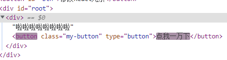
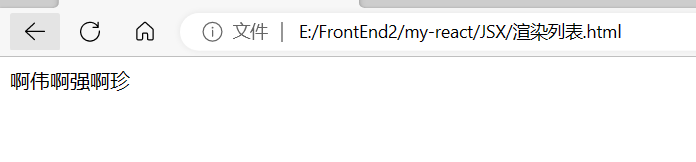

# React笔记

## React引入

### 什么是React?

与vue的作用相同，React是前端框架，用来代替DOM来构建用户界面

### React的特点

- 虚拟DOM
  - 程序员-->虚拟DOM-->DOM
  - 好处：
    - React比DOM简单，学习成本低
    - React会帮助我们解决浏览器兼容问题，减少开发成本
    - 使用虚拟DOM的性能会被直接操作DOM好
- 声明式
- 基于组件
- 支持服务器端渲染
- 快速、简单、易学

### HelloReact

- 使用js脚本引入React

  - react.development.js

  ```html
  react 是react核心库，只要使用react就必须要引入
  下载地址：https://unpkg.com/react@18.0.0/umd/react.development.js
  ```

  - react-dom.development.js

  ```html
  react-dom 是react的dom包，使用react开发web应用时必须引入
  下载地址：https://unpkg.com/react-dom@18.0.0/umd/react-dom.development.js
  ```

  ```html
  <script src="./script/react.development.js"></script>
  <script src="./script/react-dom.development.js"></script>
  ```
- 代码

  ```html
  <body>
  <div id="root"></div>
  <script>
      //创建一个React元素
      const div=React.createElement("div",{},"hello React")
      //获取根元素对应的React元素
      const root=ReactDOM.createRoot(document.getElementById("root"))
      //渲染进页面
      root.render(div)
  </script>
  </body>
  ```

## 三个API

### React.createElement()

- 用来创建一个React元素
- 参数：
  - 元素的名称（html标签要小写）
  - 标签的属性：
    - 添加类属性要用className
    - 在设置事件时，属性名需要修改为驼峰命名法，属性值为一个函数
  - 元素的内容（可以是子元素），多个元素用逗号隔开
  - 注意点：
    - React元素最终会通过虚拟DOM转换为真实的DOM元素
    - React元素一旦创建无法修改，只能通过创建新的元素进行替换

```html
<div id="root"></div>
<script>
    const btn=React.createElement("button",{
    id:"btn",
    className:"my-button",
    type:"button",
    onClick:()=>{alert('123')}
    },"点我一下")
    const div=React.createElement("div",{},btn)
    const root=ReactDOM.createRoot(document.getElementById("root"))
    root.render(div)
</script>
```

- 修改React元素后，必须重新对根元素进行渲染
- 当调用render渲染页面时，React会自动比较两次渲染的元素，只在真实DOM中更新发生变化的部分，没发生变化的保持不变
- React与vue都采用diff算法，通过修改最少的DOM来实现最好的性能

```html
<button id="btn">修改React元素</button>
<div id="root"></div>
<script>
    const button = React.createElement("button", {
        className: "my-button",
        type: "button",
        onClick: () => { alert('123') }
    }, "点我一下")
    const div = React.createElement("div", {}, "啦啦啦啦啦啦啦啦", button)
    const root = ReactDOM.createRoot(document.getElementById("root"))
    root.render(div)
    const btn = document.getElementById("btn")
    btn.onclick = () => {
        const newButton = React.createElement("button", {
            className: "my-button",
            type: "button",
            onClick: () => { alert('123') }
        }, "点我一万下")
        const div = React.createElement("div", {}, "啦啦啦啦啦啦啦啦", newButton)
        root.render(div)
    }
</script>
```

只有button发生改变



### ReactDOM.createRoot(DOM元素)

获取根元素，根元素就是React元素要插入的位置

```javascript
ReactDOM.render(div, document.getElementById('root')); // 老版本的React中使用方法
```

### root.render()

- 用来将React元素渲染到根元素中
- 根元素中所有的内容都会被删除，被React元素所替换
- 当重复调用render()时，React会将两次的渲染结果进行比较，
- 它会确保只修改那些发生变化的元素，对DOM做最少的修改

## JSX

```html
JSX 是 JavaScript 的语法扩展，JSX 使得我们可以以类似于 HTML 的形式去使用 JS。
JSX便是React中声明式编程的体现方式。声明式编程，简单理解就是以结果为导向的编程。
使用JSX将我们所期望的网页结构编写出来，然后React再根据JSX自动生成JS代码。
所以我们所编写的JSX代码，最终都会转换为以调用React.createElement()创建元素的代码。
JSX是React.createElement()的语法糖，简化了React代码的编写。
```

### 引入babel

- babel用来帮助React翻译JSX代码
- babel下载地址：https://unpkg.com/babel-standalone@6/babel.min.js
- 引入babel js文件
- script标签内的type="text/babel"，设置js代码被babel处理

### JSX语法

1. JSX不是字符串，不要加引号
2. JSX中html标签应该小写，React组件应该大写开头
3. JSX中有且只有一个根标签
4. JSX的标签必须正确结束（自结束标签必须写/）
5. 在JSX中可以使用{}嵌入表达式
   - 有值的语句的就是表达式
6. 如果表达式是空值、布尔值、undefined，将不会显示【**vue的模板会显示布尔值，其他一致**】
7. 在JSX中，属性可以直接在标签中设置
   注意：
   - class需要使用className代替
   - 事件用驼峰命名法
   - style中必须使用对象设置
     - style={{backgroundColor:'red'}}

```html
<div id="root"></div>
<script type="text/babel">
    const div = <div 
    id="box" 
    className="my-box"
    onClick={()=>{
        alert(123)
    }}
    style={{width:"100px",height:"100px",backgroundColor:"red"}}
    ></div>
    const root=ReactDOM.createRoot(document.getElementById("root"))
    root.render(div)
</script>
```

### 渲染列表

- jsx会自动解构数组，将数组中的元素在网页中显示

  ```html
  <div id="root"></div>
  <script type="text/babel">
    const arr=["啊伟","啊强","啊珍"]
    const list=<div>{arr}</div>
    const root=ReactDOM.createRoot(document.getElementById("root"))
    root.render(list)
  </script>
  ```

  
- 使用for循环

  ```html
  <div id="root"></div>
  <script type="text/babel">
      const data=["啊伟","啊强","啊珍"]
      const arr=[]
      for(let item of data){
          arr.push(<li>{item}</li>)
      }
      const list=<ul>{arr}</ul>
      const root=ReactDOM.createRoot(document.getElementById("root"))
      root.render(list)
  </script>
  ```
- 使用map

  ```html
  <div id="root"></div>
  <script type="text/babel">
      const data = ["啊伟", "啊强", "啊珍"]
      const list = <ul>{data.map(item=><li>{item}</li>)}</ul>
      const root = ReactDOM.createRoot(document.getElementById("root"))
      root.render(list)
  </script>
  ```

### 虚拟DOM

```html
在React我们操作的元素被称为React元素，并不是真正的原生DOM元素，
React通过虚拟DOM 将React元素和原生DOM进行映射，
虽然操作的React元素，但是这些操作最终都会在真实DOM中体现出来
```

- 虚拟DOM的好处：
  1. 降低API复杂度
  2. 解决兼容问题
  3. 提升性能（减少DOM的不必要操作）

```html
每当我们调用root.render()时，页面就会发生重新渲染
React会通过diffing算法，将新的元素和旧的元素进行比较
通过比较找到发生变化的元素，并且只对变化的元素进行修改，没有发生的变化不予处理

比较两次数据时，React会先比较父元素，父元素如果不同，直接所有元素全部替换
父元素一致，在去逐个比较子元素，直到找到所有发生变化的元素为止
```

#### 注意

- 当我们在JSX中显示数组中，数组中每一个元素都需要设置一个唯一key，否则控制台会显示红色警告
- 重新渲染页面时，React默认会按照顺序依次比较对应的元素（就地更新策略），如果列表的顺序永远不会发生变化，这么做当然没有问题，但是如果列表的顺序会发生变化，这可能会导致性能问题出现
- 为了解决这个问题，React为列表设计了一个key属性，key的作用相当于ID，只是无法在页面中查看，当设置key以后，再比较元素时，就会比较相同key的元素，而不是按照顺序进行比较
- 在渲染一个列表时，通常会给列表项设置一个唯一的key来避免上述问题（这个key在当前列表中唯一即可）
- 注意：

  1. 开发中一般会采用数据的id作为key
  2. 尽量不要使用元素的index作为key

  ```html
  索引会跟着元素顺序的改变而改变，所以使用索引做key跟没有key是一样的
  唯一的不同就是，控制台的警告没了
  当元素的顺序不会发生变化时，用索引做key也没有什么问题
  ```

  ```javascript
  const list = <ul>{data.map(item=> <li key={item}>{item}</li>)}</ul>
  ```

## 创建React项目

### 手动创建React项目

- 项目结构

  - 常规的React项目需要使用npm（或yarn）作为包管理器来对项目进行管理。并且React官方为了方便我们的开发，为我们提供react-scripts包。包中提供了项目开发中的大部分依赖，大大的简化了项目的开发。

  ```html
  根目录
  - public
      - index.html（添加标签 <div id="root"></div>）
  - src
      - App.js
      - index.js
  ```
- 操作

  - 进入项目所在目录，并执行命令：`npm init -y`
  - 安装项目依赖：`npm install react react-dom react-scripts -S`
  - 打包`npx react-scripts build` 打包项目，初次会询问是否加入一些默认配置(例如提高代码兼容的babel工具)，选y
    - 打包后的index.html中的src路径默认是根目录开头，需手动修改为相对路径
    - 在开发阶段使用打包来查看项目效果是不方便的，我们只有在项目开发完成后才对项目打包
  - 运行`npx react-scripts start`启动内置测试服务器，实时对代码进行编译,初次也会询问
    - ctrl+c终止批处理操作
- 描述文件
  ```json
  "scripts": {
    "start": "react-scripts start",
    "build": "react-scripts build"
  },
  /*语法检查*/
  "eslintConfig": {
    "extends": [
      "react-app"
    ]
  }
  ```

## React组件

```html
在React中网页被拆分为了一个一个组件，组件是独立可复用的代码片段。
具体来说，组件可能是页面中的一个按钮，一个对话框，一个弹出层等。
React中定义组件的方式有两种：基于函数的组件和基于类的组件。
// React组件可以直接通过JSX渲染
root.render(<组件名/>);

vscode中输入rfc快捷生成组件模板
```

### 函数组件

- 函数组件就是一个返回JSX的普通函数
- 组件的首字母必须是大写
  ```javascript
  const App=()=>{
      return <div>hello React</div>
  }
  export default App
  ```

### 类组件

- 类组件必须要继承React.Component
- 类组件中，必须添加一个render()方法，且方法的返回值要是一个jsx
- 相较于函数组件，类组件的编写要麻烦一下，但是他俩的功能是一样的
  ```javascript
  import React from "react";

  class App extends React.Component{
      render(){
          return <div>我是一个类组件</div>
      }
  }
  export default App
  ```
## React事件
- 在React中事件需要通过元素的属性来设置，和原生JS不同，在React中事件的属性需要使用驼峰命名法：
  - onclick -> onClick
  - onchange -> onChange
- 属性值不能直接执行代码，而是需要一个回调函数：
  ```javascript
  onclick="alert(123)"
  onClick={()=>{alert(123)}}
  ```
- 事件对象
  - React事件中同样会传递事件对象，可以在响应函数中定义参数来接收事件对象
  - React中的事件对象同样不是原生的事件对象，是经过React包装后的事件对象
  - 由于对象进行过包装，所以使用过程中我们无需再去考虑兼容性问题
  - 这一点与vue不同，vue传递的是原生的事件对象
- 阻止事件传导与默认行为
  - 在React中，无法通过return false取消默认行为 
  - event.preventDefault(); // 取消默认行为
  - event.stopPropagation(); // 取消事件的冒泡
- 代码示例：
  ```javascript
  export default function App() {
  function MyClick(event){
    alert("123")
    event.preventDefault()
    event.stopPropagation()
  }
  return <div>
    <button onClick={MyClick}>点我一下</button>
    <div onClick={()=>{alert("div被点了")}}><a href="#" onClick={MyClick}>click me</a></div>
  </div>
  }
  ```
## props
- 如果将组件中的数据全部写死，将会导致组件无法动态设置，不具有使用价值。我们希望组件数据可以由外部设置，在组件间，父组件可以通过props（属性）向子组件传递数据
- 在函数组件中，属性就相当于是函数的参数，可以通过参数来访问。
- 可以在函数组件的形参中定义一个props，props指向的是一个对象，它包含了父组件中传递的所有参数
- 父组件
  ```html
  <子组件 属性名1=XXX 属性名2=XXX/>
  ```
- 子组件
  ```javascript
  export default function 子组件名(props){
    console.log(props)//{属性名1:XXX,属性名2:XXX}
  }
  ```
- props是只读的不能修改