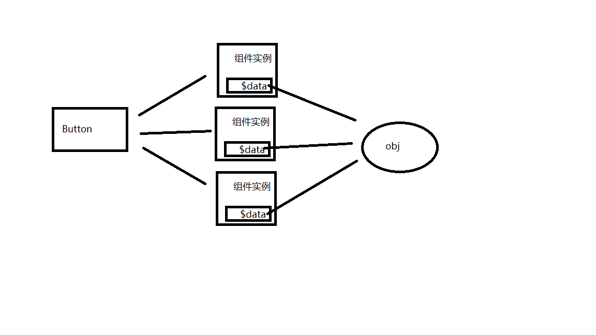

# Vue课程

## git

### 基础知识

1. 安装（略）
2. 配置

   配置name和email

   ```bash
   git config --global user.name "xxxx"
   git config --global user.email "xxx@xxx.xxx"
   ```
3. 使用git：

   - 查看当前仓库的状态

     ```bash
     git status
     ```
   - 初始化仓库

     默认情况下，磁盘中的文件并不由git管理，我们必须要对代码目录进行初始化，初始化后git才能正常的管理文件。进入目录后，直接在目录中执行git init即可完成项目的初始化，初始化后目录中会多出一个.git目录，这个目录用来存储代码的版本信息，有了.git就意味着项目现在已经开始被git管理了，不希望项目被git管理时，只需删除项目中的.git即可。

     ```bash
     git init
     ```
   - 文件状态：

     - 未跟踪

       已被git管理的项目添加新的文件，文件会处于未跟踪的状态
     - 已跟踪

       1. 暂存:表示文件修改已经保存，但未被提交到git仓库
       2. 未修改:当前文件已经提交且与仓库的文件一致
       3. 已修改:文件被修改与仓库不一致
   - 未跟踪 → 暂存

     ```bash
     git add <filename> 将文件切换到暂存的状态
     git add * 将所有已修改（未跟踪）的文件暂存
     ```
   - 暂存 → 未修改

     ```bash
     git commit -m "xxxx" 将暂存的文件存储到仓库中
     git commit -a -m "xxxx" 提交所有已修改的文件（未跟踪的文件不会提交）
     ```
   - 未修改 → 修改

     - 修改代码后，文件会变为修改状态
4. 常用的命令

   1. 重置文件

   ```bash
   git restore <filename> # 恢复文件
   git restore --staged <filename> # 取消暂存状态
   ```

   > 恢复文件能把文件从已修改状态变为未修改状态
   >
   > 所以我们在取消删除文件这个操作时，要先取消文件的暂存状态，再恢复文件
   >

   2. 删除文件

   ```bash
   git rm <filename> # 删除文件
   git rm <filename> -f # 强制删除
   ```

   3. 移动文件

   ```bash
   git mv from to # 移动文件 重命名文件
   ```

### 分支

git在存储文件时，每一次代码代码的提交都会创建一个与之对应的节点，git就是通过一个一个的节点来记录代码的状态的。节点会构成一个树状结构，树状结构就意味着这个树会存在分支，默认情况下仓库只有一个分支，命名为master。在使用git时，可以创建多个分支，分支与分支之间相互独立，在一个分支上修改代码不会影响其他的分支

```bash
   git branch # 查看当前分支
   git branch <branch name> # 创建新的分支
   git branch -d <branch name> # 删除分支
   git switch <branch name> # 切换分支
   git switch -c <branch name> # 创建并切换分支
   git merge <branch name> # 合并分支
```

在开发中，都是在自己的分支上编写代码，代码编写完成后，在将自己的分支合并到主分支中。

### 变基（rebase）

在开发中除了通过merge来合并分支外，还可以通过变基来完成分支的合并。

我们通过merge合并分支时，在提交记录中会将所有的分支创建和分支合并的过程全部都显示出来，这样当项目比较复杂，开发过程比较波折时，我必须要反复的创建、合并、删除分支。这样一来将会使得我们代码的提交记录变得极为混乱。

原理（变基时发生了什么）：

1. 当我们发起变基时，git会首先找到两条分支的最近的共同祖先
2. 对比当前分支相对于祖先的历史提交，并且将它们提取出来存储到一个临时文件中
3. 将当前分支指针指向目标的基底
4. 以当前基底开始，重新执行历史操作

   变基和merge对于合并分支来说最终的结果是一样的！但是变基会使得代码的提交记录更整洁更清晰！注意！大部分情况下合并和变基是可以互换的，但是如果分支已经提交给了远程仓库，那么这时尽量不要变基。

### 远程仓库（remote）

目前我对于git所有操作都是在本地进行的。在开发中显然不能这样的，这时我们就需要一个远程的git仓库。远程的git仓库和本地的本质没有什么区别，不同点在于远程的仓库可以被多人同时访问使用，方便我们协同开发。在实际工作中，git的服务器通常由公司搭建内部使用或是购买一些公共的私有git服务器。我们学习阶段，直接使用一些开放的公共git仓库。目前我们常用的库有两个：GitHub和Gitee（码云）

将本地库上传git：

```bash
   git remote add origin https://github.com/lilichao/git-demo.git
   # git remote add <remote name> <url>

   git branch -M main
   # 修改分支的名字的为main

   git push -u origin main
   # git push 将代码上传服务器上
```

将本地库上传gitee：

```bash
git remote add gitee https://gitee.com/ymhold/vue-course.git
   git push -u gitee main
```

### 远程库的操作的命令

```bash
   git remote # 列出当前的关联的远程库
   git remote add <远程库名> <url> # 关联远程仓库
   git remote remove <远程库名>  # 删除远程库
   git push -u <远程库名> <分支名> # 向远程库推送代码，并和当前分支关联 【远程仓库获得与当前分支同名的分支】
   git push <远程库> <本地分支>:<远程分支> 把代码发送给远程库的指定分支
   git clone <url> # 从远程库下载代码

   # 采用关联的方式上传代码，下回做操作无须完整格式，例如：
   git push # 如果本地的版本低于远程库，push默认是推不上去
   git fetch # 要想推送成功，必须先确保本地库和远程库的版本一致，fetch它会从远程仓库下载所有代码，但是它不会将代码和当前分支自动合并
   	     # 使用fetch拉取代码后，必须要手动对代码进行合并
   git pull  # 从服务器上拉取代码并自动合并
```

注意：推送代码之前，一定要先从远程库中拉取最新的代码

### tag 标签

| col1 | col2 | col3 |
| ---- | ---- | ---- |
|      |      |      |
|      |      |      |

- 头指针会指向当前节点
- 当我们回溯节点时 `git switch <提交id>  `此时头指针没有指向某个分支的头部，这种状态我们称为分离头指针（HEAD detached），分离头指针的状态下也可以操作操作代码，但是这些操作不会出现在任何的分支上，所以注意不要再分离头指针的状态下来操作仓库。
- 如果非得要回到后边的节点对代码进行操作，则可以选择创建分支后再操作

  ```bash
  git switch -c <分支名> <提交id>
  ```
- 正常开发节点有很多，我们很难去寻找回溯节点的id，这就需要借助标签来标识想保存的版本

  ```bash
  git tag
  git tag 版本
  git tag 版本 提交id
  git push 远程仓库 标签名
  git push 远程仓库 --tags
  git tag -d 标签名 # 删除标签
  git push 远程仓库 --delete 标签名 # 删除远程标签
  ```

### gitignore

- 默认情况下，git会监视项目中所有内容，但是有些内容比如node_modules目录中的内容，我们不希望它被git所管理。我们可以在项目目录中添加一个`.gitignore`文件，来设置那些需要git忽略的文件。

### github的静态页面

- 在github中，可以将自己的静态页面之间部署到github中，它会给我们提供一个地址使得我们的页面变成一个真正的网站，可以供用户访问。
- 要求：
  - 静态页面的分支必须叫做：gh-pages
  - 如果希望页面可以通过xxx.github.io访问，则需要将库的名字配置为xxx.github.io

### docusaurus

- facebook推出的开源的静态的内容管理系统，通过它可以快速的部署一个静态网站
- 使用：

  - 网址：

    - https://docusaurus.io/
  - 安装

    - `npx create-docusaurus@latest my-website classic`
  - 启动项目

    - `npm start`或`yarn start`
  - 构建项目

    - `npm run build`或`yarn build`
    -
  - 配置项目：

    - docusaurus.config.js 项目的配置文件
  - 添加页面：

    - 在docusaurus框架中，页面分成三种：1.page，2.blog，3.doc
  - 案例地址：

    - https://github.com/lilichao/lilichao.github.io

## 构建工具

- 当我们习惯了在node中编写代码的方式后，在回到前端编写html、css、js这些东西会感觉到各种的不便。比如：不能放心的使用模块化规范（浏览器兼容性问题）、即使可以使用模块化规范也会面临模块过多时的加载问题。
- 我们就迫切的希望有一款工具可以对代码进行打包，将多个模块打包成一个文件。这样一来即解决了兼容性问题，又解决了模块过多的问题。
- 构建工具就起到这样一个作用，通过构建工具可以将使用ESM规范编写的代码转换为旧的JS语法，这样可以使得所有的浏览器都可以支持代码。

### Webpack

官网：[webpack](https://webpack.docschina.org/)

- 使用步骤：

  1. 初始化项目`npm init -y`
  2. 安装依赖`webpack`、`webpack-cli`
  3. 在项目中创建`src`目录，然后编写代码（index.js）
  4. 执行`npx webpack`来对代码进行打包（打包后观察dist目录）[什么是npx](https://blog.csdn.net/qq_41040196/article/details/127916783?ops_request_misc=%257B%2522request%255Fid%2522%253A%2522167256132516800184197676%2522%252C%2522scm%2522%253A%252220140713.130102334..%2522%257D&request_id=167256132516800184197676&biz_id=0&utm_medium=distribute.pc_search_result.none-task-blog-2~all~top_click~default-2-127916783-null-null.142^v68^control,201^v4^add_ask,213^v2^t3_esquery_v2&utm_term=npx&spm=1018.2226.3001.4187)
- 配置文件（webpack.config.js）

  ```javascript
  const path = require("path")
  module.exports = {
      mode: "production", 
      entry: "./src/index.js",//指定打包时的主文件 
      output: {
      }, //配置代码打包后的地址
      module: {
          rules: [
              {
                  test: /\.css$/i,
                  use: ["style-loader", "css-loader"]
              }
          ]
      }//webpack默认情况下，只会处理js文件，如果我们希望它可以处理其他类型的文件，则要为其引入loader
  }
  ```
- 在编写js代码时，经常需要使用一些js中的新特性，而新特性在旧的浏览器中兼容性并不好。此时就导致我们无法使用一些新的特性。
- 但是我们现在希望能够使用新的特性，我们可以采用折中的方案。依然使用新特性编写代码，但是代码编写完成时我们可以通过一些工具将新代码转换为旧代码。
- babel就是这样一个工具，可以将新的js语法转换为旧的js，以提高代码的兼容性。
- 我们如果希望在webpack支持babel，则需要向webpack中引入babel的loader
- 使用步骤

  1. 安装 `npm install -D babel-loader @babel/core @babel/preset-env`
  2. 配置：

     ```javascript
     module: {
       rules: [
         {
           test: /\.m?js$/,
           exclude: /(node_modules|bower_components)/,
           use: {
             loader: 'babel-loader',
             options: {
               presets: ['@babel/preset-env']
             }
           }
         }
       ]
     }
     ```
  3. 在package.json中设置兼容列表

     ```json
     "browserslist": [
             "defaults"
      ]
     ```

     https://github.com/browserslist/browserslist
- 插件（plugin）

  - 插件用来为webpack来扩展功能
  - 对比loader，loader主要用来完成对源代码的编译工作，而插件主要用来帮助开发的一些辅助操作，不会对代码进行修改
  - html-webpack-plugin

    - 这个插件可以在打包代码后，自动在打包目录生成html页面
    - 使用步骤：

      1. 安装依赖
         ```
         npm install -D html-webpack-plugin
         ```
      2. 配置插件

      ```javascript
      plugins: [
              new HTMLPlugin({
                  // title: "Hello Webpack",
                  template: "./src/index.html"//配置html模板
              })
          ]
      ```
- 开发服务器（webpack-dev-server）

  - 作用：浏览器的代码会自动打包发送给临时服务器实时运行，打包后的数据不在本地的dist目录，要想在本地看到dist目录还是得手动打包
  - 安装：`npm install -D webpack-dev-server`
  - 启动：`npx webpack serve --open`
- `devtool:"inline-source-map"` 在webpack配置文件配置源码的映射，便于在浏览器开发者工具对代码进行调试

  - 需要设置mode为开发者模式

### Vite

官网：[vite](https://vitejs.cn/)

- Vite也是前端的构建工具
- 相较于webpack，vite采用了不同的运行方式：

  - 开发时，并不对代码打包，而是直接采用ESM的方式来运行项目
  - 在项目部署时，在对项目进行打包
- 除了速度外，vite使用起来也更加方便
- 基本使用：

  1. 安装开发依赖   `npm install -D vite`
  2. vite的源码目录就是项目根目录

     vite默认找的是index.html，所以我们把源码放进其他目录里无须修改配置文件
  3. 开发命令：

     `npx vite` 启动开发服务器

     `npx vite --open` 启动开发者服务器并打开网站

     `npx vite build` 打包代码

     `npx vite preview` 预览打包后代码
- 使用命令构建

  ```bash
  npm create vite@latest
  yarn create vite
  pnpm create vite
  ```
- 配置文件：`vite.config.js`
- 示例：配置legacy插件来转换代码兼容老版本的浏览器：

  安装插件

  `npm add -D @vitejs/plugin-legacy`

  修改配置文件

  ```javascript
  import { defineConfig } from "vite"
  import legacy from "@vitejs/plugin-legacy"

  export default defineConfig({
      plugins: [
          legacy({
              targets: ["defaults"]
          })
      ]
  })
  ```

## Vue3

### 回顾之前的学习

- node.js：我们的服务器是MVC的模式，服务器直接将渲染后的页面发送给客户端
- ajax：我们的服务器是rest风格的服务器，服务器将数据以json形式发送给客户端，由客户端去渲染。
  - 此时我们的模式改变成mvvm，我们需要view model来将服务器返回的模型变成视图，在这个学习阶段我们通过DOM来实现
  - 使用DOM实现这个功能有两个缺点：麻烦和性能不好，所以我们需要前端js框架来代替DOM

### 什么是vue

- [vue官网](https://cn.vuejs.org/)
- vue是一个前端的框架，主要负责帮助我们构建用户界面（user-interface）
- MVVM：Model - View - View Model
- vue负责vm的工作（视图模型），通过vue可以将视图和模型相关联。

  - 当模型发生变化时，视图会自动更新
  - 也可以通过视图去操作模型
- vue思想：

  - 组件化开发：把整个网页拆分成多个组件
  - 声明式的编程
    - 命令式编程（Imperative）：详细的命令机器怎么（How）去处理一件事情以达到你想要的结果（What）
    - 声明式编程（ Declarative）：只告诉你想要的结果（What），机器自己摸索过程（How）
  - 渐进式：基于其他前端框架的项目也可以部分采用vue编写

### 引入vue3

1. 直接在网页中使用（像jQuery一样）

   - `<script src="https://unpkg.com/vue@3/dist/vue.global.js"></script>`
   - ```javascript
     //创建一个按钮，可以显示按钮的点击的次数
     //创建组件
     const Root = {
         data() {
             return {
                 count: 0 // 记录点击次数
             }
         },
         template:
             `<button @click='count++'>点我一下</button> - 点了{{count}}次`
     }
     //创建app实例并挂载
     Vue.createApp(Root).mount("#app")
     ```
2. 使用vite

   - `npm install vite -D`
   - `npm install vue`
   - ```javascript
     // 这里引入的vue，默认不支持通过template属性来设置模板
     import {createApp} from "vue/dist/vue.esm-bundler.js"
     const App={
         data(){
             return{
                 message:"Vue3"
             }
         },
         template:`<h1>hello{{message}}</h1>`
     }
     createApp(App).mount("#app")
     ```
3. 代码：

   ```javascript
   // 组件，就是一个普通js对象
   const App = {}

   // 返回一个应用实例，将根组件关联到应用上
   const app = createApp(App)

   // 将应用挂载到页面，生成一个组件实例(视图模型)，组件实例类型是一个Proxy对象（代理对象）
   const vm=app.mount("#root")
   //该方法接收一个参数，可以是一个实际的 DOM 元素或是一个 CSS 选择器字符串
   ```
4. 自动创建vue项目

   - `npm init vue@latest`
   - `npm install`安装依赖

### 选项式API

- 组件

  - vue3中组件就是一个普通的js对象
  - 组件用来创建组件实例(vm)，组件是组件实例的模板
  - 组件 --> 组件生成组件实例 --> 虚拟DOM --> DOM（在页面中呈现）
  - 组件的作用：组件使得我们可以生成多个组件实例在不同的地方使用，组件实例相互独立不会互相影响，大大提高了代码的复用性
  - 分类：
    - 根组件：`createApp(根组件名)`直接使用，一个项目一般只有一个根组件（项目部分使用vue可以创建多个app）
    - 子组件：
      - 引入子组件
      - 在组件中注册子组件

        ```javascript
        import MyButton from "./components/MyButton"
        export default {
            data() {
                return {
                    message: "Vue3"
                }
            },
            //注册组件
            components:{
                MB:MyButton
            },
            template: `<h1>hello{{message}}</h1>
                        <MB></MB>
                        <MB></MB>
                        <MB></MB>
                        `
        }
        ```
- data

  - data是一个方法，需要一个对象作为返回值，用来指定实例对象中的响应式属性
  - data方法返回的对象，vue会对该对象进行代理，从而将其转换为响应式数据，响应式数据可以直接通过组件实例访问

    - 响应式数据改变，页面会跟着改变
    - 直接向组件实例中添加的属性不会被vue所代理，不是响应式数据，修改后页面不会改变
    - 组件实例`vm.$data`才是真正的代理对象，我们可以使用这个属性动态添加响应式数据，不建议这么做
  - 在data中，this就是当前的组件实例vm

    - vue给组件中的data方法绑定了this为vm
  - 如果使用箭头函数，则无法通过this来访问组件实例

    - 绑定对箭头函数无效
  - 内置第一个参数就是组件实例vm，箭头函数可以以此来访问vm
  - 在vue中使用选项式API，尽量减少箭头函数的使用
  - 注意点

    - 返回唯一对象

    ```javascript
    <script>
    //问题1：返回唯一对象
        const obj={count :0}
        export default{
            data(){
                return obj
            }
        }
    </script>
    <template>
        <button @click="count++">{{ count }}</button>
    </template>
    ```

    

    - 代理的是同一个对象，这导致一个组件实例改变数据，其他组件实例跟着改变，开发中要避免这种写法
    - 深层对象&浅层对象

      - 深层对象指的是一个对象里有多层对象（对象套娃）
      - data返回的数据都会被vue代理，无论该数据处于第几层
      - ```javascript
        <script>
        import Button from './components/Button.vue'
        import {shallowReactive} from"vue"
        export default{
          data(){
            this.name="lusiyan"//非响应式数据
            console.log(this)
            window.vm=this
            return shallowReactive({
              msg:"hi vue",
              stu:{
                name:"啊伟",
                age:"20",
                gender:"男",
                friend:{
                  name:"啊强",
                  age:"28"
                }
              }
            })
          },
          components:{
            Button
          }
        }
        </script>
        ```
      - shallowReactive使得data返回的对象变为浅层对象，嵌套对象的属性不再是响应式数据，只有表面的msg,stu才是
      - 动态的响应式数据
        - 上述vm.$data这种方式不被我们所鼓励使用，原因是导致数据分布杂乱，不利于代码维护
        - 我们可以直接在return{}对象里声明待响应的数据，在响应事件触发再对该数据进行赋值
      - data返回的对象属性是数组
        - 由于vue3底层使用代理，可以直接在模板用索引引用数组中的数据
- method

  - 用来指定实例对象中的方法
  - 它是一个对象，可以在它里边定义多个方法
  - 这些方法最终将会被挂载到组件实例上
  - 可以直接通过组件实例来调用这些方法，所有组件实例上的属性都可以在模板中直接访问
  - methods中函数的this会被自动绑定为组件实例，箭头函数与data同理
  - ```javascript
    <script>

        export default{
            data(){
                window.vm=this
                return{
                    msg:"hhhhhhh"
                }
            },
            methods:{
                test(){
                    alert("哈哈哈哈哈")
                },
                HelloWorld(){
                    console.log(this)
                    return "hello world"
                },
                changeMsg(){
                    this.msg="嘻嘻嘻"
                }
            }
        }
    </script>
    <template>
        <h1>{{ msg }}</h1>
        <h2>{{ HelloWorld() }}</h2>
        <button @click=changeMsg>点一下</button>
    </template>
    ```
- computed，用来指定计算属性

  - 定义与调用方式

    ```javascript
    computed:{
                计算属性名:{
                    getter,
                    setter
                }
            }
    //如果只有getter，则可以直接简写成属性名(){}
    //getter只做读取相关的逻辑，不要去执行会产生作用的代码（例如修改）
    //在开发中我们很少用setter，原因是可能让代码看起来复杂，可读性变差
    ```

    ```javascript
    {{计算属性名}}//调用getter
    组件实例.计算属性名=xxx//计算属性同样会挂载在组件实例上，setter在计算属性被修改时调用

    ```
  - 作用

    - 相比data中生成的属性，计算属性用函数返回结果，在函数中可以写一些逻辑。
    - 相比使用方法，计算属性有缓存，只在其依赖的数据发生变化时才会重新执行。methods中的方法每次组件重新渲染都会调用，他没有缓存。这样性能更好
    - 证明计算属性实现缓存：控制台输入`组件实例.计算属性名`，计算属性方法不会重复调用
    - 当年的属性不是直接显示，而是需要一定逻辑，就可以用计算属性
- template

  - 模板，它决定了组件最终的样子
  - 定义模板的方式有三种：
    - 1.在组件中通过template属性去指定

      - 如果在组件中定义template，则会优先使用template作为模板，同时根元素中的所有内容，都会被替换
      - 如果在组件中没有定义template，则会使用根元素的innerHTML作为模板使用
    - 2.直接在网页的根元素中指定

      - 如果直接将模板定义到网页中，此时模板必须符合html的规范

        - 自定义组件名为`My-Button`，在html里会自动转换成小写`my-button`，对我们使用组件有一定限制
    - 3.组件中通过render()直接渲染
- data & template

  - 在模板中可以直接访问组件实例中的属性
    - 在模板中可以通过 {{属性名}} 来访问到组件实例中的属性
  - data中的响应式数据发生变化视图会自动更新

### 单文件组件

上述template是用字符串的形式编写的模板

- 这些字符串会在项目运行时，在浏览器中被编译为js的函数（性能不太好）
- 在字符串中编写代码，体验很差

为了解决这个问题，Vue为我们提供了一种单文件组件（SFC）

- 单文件组件的格式是vue（vscode需要安装插件 Vue Language Features (Volar)来辅助实现代码高亮和提示）
- vue文件用来编写单文件组件，vue文件本身并不能被浏览器所识别，所以它必须要被构建工具打包后，才可使用
- 同时vue文件在打包时，构建工具会直接将template转换为函数，无需再浏览器中在去编译，这样一来性能也会有所提升

使用

- 安装包扩展vite功能  `npm install -D @vitejs/plugin-vue`
- 修改配置文件

  ```javascript
  import vue from "@vitejs/plugin-vue"

  export default {
      plugins: [vue()]
  }
  ```
- 创建单文件组件 `.vue`

  - js代码写进`<script></script>`
  - 模板代码写进`<template></template>`

示例

```javascript
<script>
import MyButton from "./components/Button.vue";
export default {
    data(){
        return {
            message:"hi vue3"
        }
    },
    components:{
        MyButton
    }
}
</script>
<template>
    <h1>{{ message }}</h1>
    <MyButton></MyButton>
    <MyButton></MyButton>
    <MyButton></MyButton>
</template>
```

### 响应式原理-代理

- 直接修改对象的属性，那么就是仅仅修改了属性，没有去做其他的事情，这种操作只会影响对象自身，不会导致元素的重新的渲染
- 我们希望在修改一个属性的同时，可以进行一些其他的操作，比如触发元素重新渲染。
- 要实现这个目的，必须要对对象进行改造，vue3中使用的是的代理模式来完成对象的改造
- 生成代理对象的示例：

  ```javascript
  const obj={
      name:"啊伟",
      age:20
  }
  //用来指定代理的行为
  const handler={
      get(target, prop, receiver){
  	//返回值之前做一些其他的操作...
          return target[prop]
      },
      set(target, prop, value, receiver){
          target[prop]=value
  	//值修改之后做一些其他的操作
      }
  }
  //创建代理
  const proxy=new Proxy(obj,handler)
  console.log(proxy.name)//啊伟
  proxy.name="阿强"
  console.log(obj.name)//啊强
  ```
- 使用代理对象读取属性，会调用handler中的get方法

  - get用来指定读取数据时的行为，它的返回值就是最终读取到的值
  - target：被代理的对象
  - prop：读取的属性
  - receiver：代理对象
- 使用代理对象修改属性，会调用handler中的set方法

  - target：被代理的对象
  - prop：修改的属性
  - value：值
  - receiver：代理对象
- 代理对象的意义：可以在不会对原对象产生影响的前提下，拓展对象的读取功能，例如自动渲染
- vue的代理原理

  - 在vue中，data()返回的对象会被vue所代理
  - vue代理后，当我们通过代理去读取属性时，返回值之前，它会先做一个跟踪的操作
    - 源码做了一个`track() //追踪谁用了我这个属性，并记录下来`
  - 当我们通过代理去修改属性时，修改后，会通知之前所有用到该值的位置进行更新
    - 源码做了一个一个`trigger() //触发所有的使用该值的位置进行更新`

### 组合式API

- 上述语法是选项式的写法，在开发中大多用组合式写法
- 相比之前的写法：

  - 对象有语法限制，只能写属性和方法，函数什么代码都能写
  - 对象没有作用域，函数有作用域，局部变量对其他地方无任何影响
- 定义变量

  - 在组合式api中直接声明的变量，就是一个普通的变量，不是响应式属性，修改这些属性时，不会在视图中产生效果
  - reactive()来创建一个响应式的对象
- 返回值

  - 通过返回值来指定那些内容要暴露给外部。暴露后的内容，可以在模板中直接使用
- 代码

  ```javascript
  <script>
  import { reactive } from 'vue'
  export default{
      setup(){
          let msg="组合式api"
          const countB=reactive({count:0})
          function clickB(){
              countB.count+=1
          }
          return{
              mssge,
              clickB,
              countB
          }
      }
  }
  </script>
  <template>
  <button @click=clickB>点我一下</button>--点了{{ countB.count }}
  <h1>{{ msg }}</h1>
  </template>>
  ```

  ```javascript
  <script setup>
  import { reactive } from 'vue';
  let msg="简写组合式api"
  const stu=reactive({
      name:"阿伟",
      age:18
  })
  </script>
  <template>
  <h1>{{ msg }}</h1>
  <h2>{{ stu.name }}--{{ stu.age }}</h2>
  </template>
  ```

### 组合式API响应式代理

- reactive()

  - 返回一个对象的响应式代理
  - 返回的是一个深层响应式对象
  - 也可以使用shallowReactive()创建一个浅层响应式对象
  - 缺点：只能返回对象的响应式代理！不能处理原始值
- ref()

  - 接收一个任意值，把它转换为对象，并返回对象的响应式代理
  - 改变量只会影响到变量自己(给变量重新赋一个地址值)，在js中，无法实现对一个变量的代理
  - ref在生成响应式代理时，它是将值包装为了一个对象`0  --> {value:0}`
  - 访问ref对象时，必须通过 对象.value 来访问其中的值
  - 在模板中，ref对象会被自动解包（要求ref对象必须是顶层对象）

  ```javascript
  <script setup>
  import { reactive,ref,shallowReactive } from 'vue';
  const stu=reactive(shallowReactive({
    name:"阿伟",
    age:18,
    friend:{
      name:"阿强",
      age:25
    }
  })) 
  let count=ref(0)
  function clickCount(){
    count.value++
  }  
  </script>
  <template>
    <h1>{{ msg }}</h1>
    <button @click=clickCount>点我一下</button>--{{ count }}
    <h2>{{ stu.friend.name }}</h2>
  </template>
  ```

  ```javascript
  <script setup>
  import { ref } from 'vue';
  let msg="组合式api补充"
  const obj=ref({
      name:"阿伟",
      age:18
  })//{value:{name:"阿伟",age:18}}
  const obj1={
      name:ref("啊强"),//{value:"阿强"}
      age:ref(18)
  }
  </script>
  <template>
      <h1>{{ msg }}</h1>
      <h2>{{ obj.name }}</h2>
      <h2>{{ obj1.name }}</h2><!--"阿强"，调用了对象的toString方法-->
      <h2>{{ obj1.name.value }}</h2>
  </template>
  ```

### 组合式API计算属性

```javascript
<script setup>
import { computed } from 'vue';
let msg="hello vue"
const newMsg=computed(()=>{
    return msg+="你好vue"
})
</script>
<template>
    <h1>{{ msg }}</h1>
    <h1>{{ newMsg }}</h1>
</template>
```

### 模板的语法

- 在模板中，可以直接访问到组件中声明的变量
- 除了组件中的变量外，vue也为我们提供了一些全局对象可以访问：比如：Date、Math、RegExp ...
- [受限的全局访问](https://github.com/vuejs/core/blob/main/packages/shared/src/globalsWhitelist.ts#L3)
- 除此之外，也可以通过app对象来向vue中添加一些全局变量`app.config.globalProperties`
- 使用插值(双大括号)，只能使用表达式【表达式，就是有返回值的语句】
- 插值实际上就是在修改元素的textContent，如果内容中含有标签，标签会被转义显示，不会作为标签生效

指令：

- 指令模板中为标签设置的一些特殊属性，它可以用来设置标签如何显示内容。使用指令时，不需要通过{{}}来指定表达式
- 指令使用v-开头

  - v-text 将表达式的值作为元素的textContent插入，作用同{{}}
  - v-html 将表达式的值作为元素的innerHTML插入，有xss注入的风险

    ```javascript
    <div v-text="s"></div>
    <div v-html="s"></div>
    ```
  - v-bind 为标签动态地设置属性，可简写为":"

    - 在vue中不能把插值直接设置为标签的属性
    - v-bind设置布尔值属性(属性名=属性值)时，若设置的变量非布尔值会自动转换，转换规则除 `""==true`外与js中相同

      ```
      v-bind:属性名="变量名"
      v-bind="对象名"//绑定多个属性
      v-bind:[name]="value"//动态添加属性
      ```
  - v-show=Boolean 底层通过"display"来设置一个内容是否显示

    - 通过css样式，不会涉及到组件的重新渲染，切换的性能比较高
    - 但是初始化对所有组件初始化（包括隐藏的组件），所有它的初始化性能差
  - v-if=表达式 可以根据表达式的值来决定是否显示元素

    - 通过删除添加元素的方式来切换元素的显示，切换时反复地渲染组件，切换的性能比较差
    - 只会初始化需要用到的组件，所有它初始化性能比较好
    - 可以搭配其他指令一起使用，例如v-else,v-else-if，适用于一些更复杂的场景
    - 可以配合template使用
    - ```html
      <script setup>
      import {ref} from "vue"
      const isShow=ref(true)
      </script>
      <template>
          <button @click="isShow=!isShow">切换</button>
          <template v-if="isShow"><!--统一控制多行代码，经过浏览器编译后template会隐藏-->
              <h1>1111</h1>
              <h2>22222</h2>
              <!--很多条代码-->
          </template>
      </template>
      ```
  - v-for="xxx in 数组"，数组里有多少项就会遍历几次
  - Vue 默认按照“就地更新”的策略来更新通过 `v-for` 渲染的元素列表。也就是默认根据元素顺序对比新旧列表的差距来最小程度地修改DOM，如果打乱顺序，可能导致与我们要的结果不同。

    ```
    <script setup>
    import {reactive} from"vue";
    const arr=reactive([{
        id:1,
        name:"啊伟",
        age:18
    },{
        id:2,
        name:"啊强",
        age:20
    },{
        id:3,
        name:"啊洪",
        age:16
    }])
    </script>
    <template>
        <button @click="arr.unshift({id:4,name:'啊飘',age:15})">点我</button>
        <ul>
            <li v-for="{name,age} in arr">{{ name }}--{{ age }} <input type="text"></li>
        </ul>
    </template>
    ```

    ```
    1 2 3
    4 1 2 3
    由于vue默认是根据顺序对比比较来修改DOM，它会把1变为4，2变为1，3变为2，最后添加3
    由于我们只修改数组，并不改变表单，所以表单没有做DOM修改，造成错位的现象。
    ```
  - 为了解决这个错位的问题，我们可以在标签内添加key属性来唯一标识每一项。

    ```
    添加后：
      1 2 3
    4 1 2 3
    vue只会在列表最前面插入一个DOM元素
    ```
- `<template></template>`作为容器，会被浏览器解析隐藏，直接呈现标签内的内容

public

- 在模板中可以直接引用public中的内容
- public里的内容会直接打包到dist目录下，在书写路径直接从"/..."开始写

### 样式

- 全局样式:在组件中写会影响到当前页面的所有组件

  - `<style></style>`

  ```css
  <style scoped>
  :global(h1){
      font-size: 6px;
  }
  </style>
  ```
- 组合式API可以在模板中直接写子组件，无需注册
- scoped

  - 可以为style标签添加一个scoped属性，这样样式将成为局部样式，只对当前组件生效，降低代码的耦合性
  - 如何实现的？
    - 当我们在组件中使用scoped样式时，vue会自动为组件中的所有元素生成一个随机的属性
      形如：data-v-7a7a37b1
      生成后，所有的选择器都会在最后添加一个 [data-v-7a7a37b1]

      ```
      h1 -> h1[data-v-7a7a37b1]
      .box1 -> .box1[data-v-7a7a37b1]
      ```
    - 注意：随机生成的属性，除了会添加到当前组件内的所有元素上，也会添加到当前组件引入的其他组件的**单根元素**（多根元素不会生效）上，这样设计是为了可以通过父组件来为子组件设置一些样式
  - :deep(选择器){样式}--可以给子组件单根元素下的所有符合选择器的元素绑定样式
- module

  - 自动的对模块中的类名进行hash化来确保类名的唯一性
  - 在模板中可以通过 `:class=$style.类名` 使用
  - 也可以通过module的属性值来指定变量名(默认是$style)

    ```javascript
    <script setup></script>
    <template>
        <div :class=$style.box1></div>
    </template>
    <style module>
    .box1{
        widows: 200px;
        height: 200px;
        background-color: red;
    }
    </style>
    ```
- 类和内联样式

  ```javascript
  <script setup>
  const arr=["box1","box2","box3"]
  const arr2=[{box1:true},{box2:false},{box3:true}]
  const style={
      color:"red",
      fontSize:"18px"
  }
  </script>
  <template>
      <div :class="arr" :style="style">hello vue</div>
      <div :class="arr2"></div>
  </template>
  <style></style>
  ```

### props

- 组件的数据在什么时候生成？

  - 应该是在组件被使用时，即生成组件实例的时候产生，这就涉及到我们要怎么从父组件向子组件传递数据
- 父组件可以通过props来向子组件传递数据
- 子组件

  ```
  const props=defineProps(["属性名","属性名".............])//定义
  {{props.属性名}}//使用
  ```
- 父组件

  ```
  <子组件 :属性名="变量名",属性名=字面量></子组件>
  ```
- 这种传递方式属于单向数据流，props中的数据是只读的，不可修改。

  - 好处：确保数据的安全性，降低项目的复杂度
  - 原则：对于这种响应式数据，对它的修改只能由唯一组件完成（即创建数据的组件）
  - 只读锁定的是变量中存储的地址值，如果props的某个属性是对象，那这个对象的属性还是可以修改的
    - 即使这种情况可以修改，我们还是要尽量避免修改操作，做到数据不创建就不修改。
- 属性名规范

  - 子组件定义时采用驼峰命名法"xxYyZz"
  - 父组件模板内采用"xx-yy-zz"
- 配置

  ```
  const props=defineProps({
    属性名:类型,
    属性名:{
        type:,//指定属性类型
        required:true,//必须有这个属性
        default:,//设置默认值
        validator(value){
              return 布尔值
         }//验证数据
    }//配置对象
  })
  ```

  - 类型限制并不影响取值，开发中帮助我们做类型检查让我们项目更加严谨
  - 不符合以上配置并不会报错，而是报警告，便于我们对代码进行优化
  - 对于子组件有定义，父组件未传值的属性，除布尔值是false外，其余类型均是undefined

### 动态组件

- Component
  - 最终以什么标签呈现由is属性决定
  - ```html
    <script setup>
    import {ref} from"vue"
    import A from "./components/A.vue"
    import B from "./components/B.vue"
    const isShow=ref(true)
    </script>
    <template>
      <button @click="isShow=!isShow">切换</button>
      <component :is="isShow?A:B"></component>
    </template>
    ```

### 网页的渲染

- 浏览器在渲染页面时，做了那些事：

  1. 加载页面的html和css（源码）
  2. html转换为DOM，css转换为CSSOM
  3. 将DOM和CSSOM构建成一课渲染树
  4. 对渲染树进行reflow（回流、重排）（计算元素的位置）
  5. 对网页进行绘制repaint（重绘）
- 构建渲染树（Render Tree）

  - 从根元素开始检查那些元素可见，以及他们的样式
  - 忽略那些不可见的元素（display:none）【在网页占位置的元素应该进树】
- 重排、回流

  - 计算渲染树中元素的大小和位置
  - 当页面中的元素的大小或位置发生变化时，便会触发页面的重排（回流）
  - 某个元素改变会影响其他元素，所以需要重排确定其他元素的位置
  - 例如width、height、margin、font-size ......
  - 注意：每次修改这类样式都会触发一次重排！所以如果分开修改多个样式会触发重排多次，而重排是非常耗费系统资源的操作（昂贵），重排次数过多后，会导致网页的显示性能变差，在开发时我们应该尽量的减少重排的次数
    - 把所有需要修改的样式包装成一个类，再把类添加到元素上
    - 修改元素为display:"none"，做任意的修改操作，在最后再把display改回来
  - 在现代的前端框架中，这些东西都已经被框架优化过了！（框架操作的是虚拟DOM，无论做了多少次修改，最终只会做一次重排）所以使用vue、react这些框架这些框架开发时，几乎不需要考虑这些问题，唯独需要注意的时，尽量减少在框架中修改原生DOM
- 重绘

  - 绘制页面
  - 当页面发生变化时，浏览器就会对页面进行重新的绘制
- 例子：

  ```html
  <!DOCTYPE html>
  <html lang="zh">
      <head>
          <meta charset="UTF-8" />
          <meta http-equiv="X-UA-Compatible" content="IE=edge" />
          <meta name="viewport" content="width=device-width, initial-scale=1.0" />
          <title>Document</title>
          <style>
              .box1 {
                  width: 200px;
                  height: 200px;
                  background-color: orange;
              }

              .box2 {
                  background-color: tomato;
              }

              .box3 {
                  width: 300px;
                  height: 400px;
                  font-size: 20px;
              }
          </style>
      </head>
      <body>
          <button id="btn">点我一下</button>
          <hr />
          <div id="box1" class="box1"></div>
          <script>
              btn.onclick = () => {
                  // box1.classList.add("box2")
                  // 可以通过修改class来间接的影响样式，来减少重排的次数
                  // box1.style.width = "300px"
                  // box1.style.height = "400px"
                  // box1.style.fontSize = "20px"
                  // box1.classList.add("box3")
                  // box1.style.display = "none"
                  // box1.style.width = "300px"
                  // box1.style.height = "400px"
                  // box1.style.fontSize = "20px"
                  // div.style.display = "block"
              }
          </script>
      </body>
  </html>
  ```

### 插槽

- 希望在父组件中指定子组件中的内容，可以通过插槽（slot）来实现该需求
- 插槽入口：

  ```
  <子组件>内容</子组件>
  ```
- 插槽出口

  ```
  子组件模板内的<slot>XXX</slot>  XXX为默认，当入口无值时使用
  ```
- 具名插槽

  ```
  <slot name="xxx"></slot>

  <子组件>
      <template v-slot:xxx>//v-slot:可以简写为#
      <template>
  </子组件>
  ```
- 默认插槽

  - 直接在子组件书写的文本或标签会被当成默认插槽的内容

  ```
  <子组件>内容</子组件>
  相当于：
  <子组件>
      <template v-slot:default>
      <template>
  </子组件>

  对应的出口：
  <slot name="default"></slot>
  <slot></slot>

  ```
- 组件在哪引入就是谁的子组件，子组件可以使用父组件定义的变量
- 子组件可以通过属性将数据传到父组件，其"兄弟组件"就可以使用该数据

  ```
  子组件：<slot name="Box" :stu="stu"></slot>
  父组件：<template v-slot:Box="stu">
             {{ stu }}
          </template>
  ```

### 事件

为元素绑定事件：

- 绑定事件使用v-on指令
  - v-on:事件名
  - 简写为：@事件名
- 绑定事件的两种方式：

1. 内联事件处理器（自己调用函数）

   - 事件触发时，直接执行js语句
   - 内联事件处理器，回调函数的参数由我们自己传递
   - 在内联事件处理器中，可以使用$event来访问事件对象

   ```
   foo++
   foo()
   ```
2. 方法事件处理器（vue帮我们调用函数）

   - 事件触发时，vue会对事件的函数进行调用
   - 方法事件处理器，回调函数的参数由vue帮我们传
   - 参数就是事件对象，这个事件对象就是DOM中原生的事件对象，它里边包含了事件触发时的相关信息

   ```
   foo
   foo.bar
   ```

- vue如何区分两种处理器：

  ```
  检查事件的值是否是合法的js标识符或属性访问路径
  如果是，则表示它是方法事件事件处理器。
  否则，表示它是内联事件处理器
  ```
  ```javascript
  <script setup>
  function f(text){
      alert(text)
  }
  </script>
  <template>
      <div class="box1" v-on:click="f('box1')">
          <div class="box2" v-on:click="f('box2')">
              //使用.stop阻止事件之间的传导，底层就是event.stopPropagation()
              <div class="box3" v-on:click.stop="f('box3')"></div>
          </div>
      </div>
  </template>
  ```
